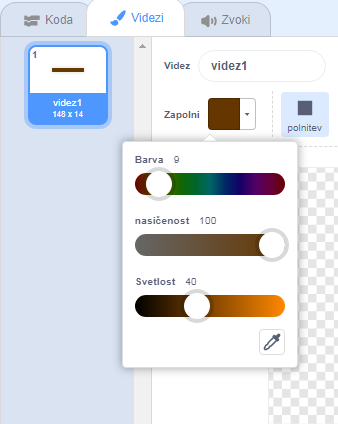

## Ovire in pospeševalci

Trenutno je igra **resnično** preveč enostavna, zato boš dodal še nekaj stvari, ki jo bodo naredile bolj zanimivo.

Najprej boš dodali nekaj pospeševalcev, ki bodo pohitrili čoln.

\--- task \---

Uredi ozadje odra, tako da dodaš nekaj belih puščic za pospeševanje.


\--- /task \---

\--- task \---

Sedaj v zanko `ponavljaj`{: class = "block3control"} dodaj bloke kode, ki bodo figuro čolna premaknile za tri dodatne korake, kadar se čoln dotakne bele puščice.


```blocks3
če <touching color [#FFFFFF] ?> potem
pojdi (3) korakov
konec
```

\--- /task \---

\--- task \---

Preizkusi igro, da vidiš, ali te nove pospeševalne puščice zares pospešijo čoln.

\--- /task \---

Zdaj boš dodal še vrstečo se zapornico, ki se je mora čoln izogibati.

\--- task \---

Dodajte novo figuro, ki izgleda takole, in jo poimenuj 'zapornica':


Poskrbi, da je barva zapornice enaka barvi lesenih ovir.



\--- /task \---

\--- task \---

Poskrvi, da je središče figure zapornice postavljeno na sredino.


\--- /task \---

\--- task \---

Figuri zapornice dodaj kodo, ki jo bo ves čas počasi vrtela.

\--- hints \--- \--- hint \---

Figuri zapornice dodaj bloke kode, da se figura `obrne za 1 stopinjo`{:class="block3motion"} in to `ponavlja`{:class="block3control"}.

\--- /hint \--- \--- hint \---

To so bloki kode, ki jih potrebuješ:


```blocks3
ponavljaj
konec

obrni se za (1) stopinj v desno

ko kliknemo na zastavico
```

\--- /hint \--- \--- hint \---

Tvoja koda naj bi izgledala tako:


```blocks3
ko kliknemo na zastavico
ponavljaj
obrni se za (1) stopinj v desno
konec
```

\--- /hint \--- \--- /hints \---

\--- /task \---

\--- task \---

Zpoet preizkusi svojo igro. Zdaj bi morala imeti vrtečo se zapornico, okoli katere moraš pripeljati svoj čoln.


\--- /task \---