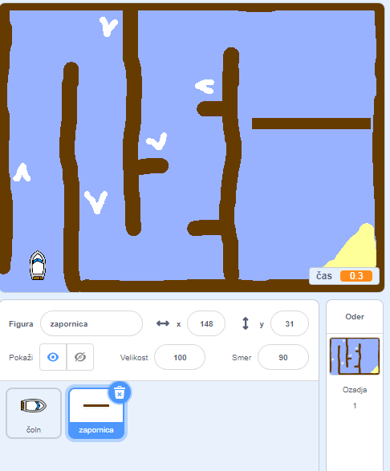
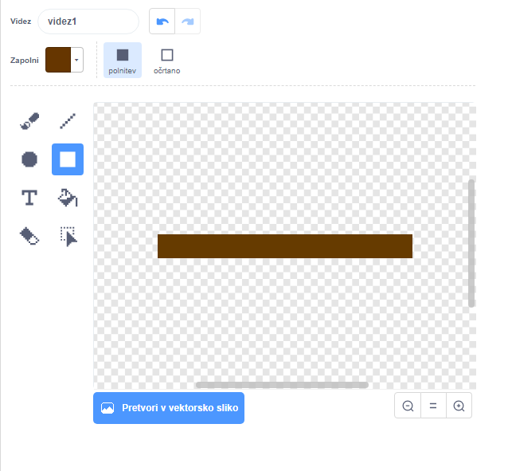
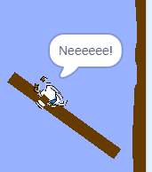

## Ovire in ojačevalci

Zdaj igra je **daleč** preveč enostavno, tako da bo dodal nekaj stvari, da bi bilo bolj zanimivo.

Najprej boste dodali nekaj ojačevalcev za pospešitev plovila.

\--- task \---

Uredite ozadje Stage, tako da dodate nekaj belih puščic.


\--- /task \---

\--- task \---

Sedaj dodajte več kodnih blokov na zanko `vedno`{: class = "block3control"}, tako da bo žig ladje premaknil tri dodatne korake, ko se dotakne bele puščice. 

```blocks3
če <touching color [#FFFFFF] ?> potem
premaknete (3) koraka
konec
```

\--- /task \---

\--- task \---

Preizkusite igro, da vidite, ali vaše nove pospeševalne puščice pospešijo čoln.

\--- /task \---

Nato boste dodali vrteča se vrata, ki jih mora čoln izogibati.

\--- task \---

Dodajte nov duh, ki izgleda takole, in ga pokličite »vrata«:



Prepričajte se, da je barva vratnega duhu enaka barvi lesenih ovir.

\--- /task \---

\--- task \---

Prepričajte se, da je središče čarovnika v sredini.



\--- /task \---

\--- task \---

Dodajte kodo na vašo vrata, da se bo za vedno vrtela.

\--- napotki \--- \--- namig \--- Dodaj blokov kode za vrat Sprite tako, da `obrne 1 stopnja`{: razred = "block3motion"} `vedno`{: razred = "block3control"} . \--- / namig \--- \--- namig \--- Tu so kodni bloki, ki jih potrebujete: 

```blocks3
za vedno
konec

obrni cw (1) stopinj

ko je zastavica kliknila
```

\--- / namig \--- \--- namig \--- Evo, kakšna naj bo vaša nova koda: 

```blocks3
ko je zastavica kliknila
vedno
obrni cw (1) stopinj
konec
```

\--- / namig \--- \--- / namigi \---

\--- /task \---

\--- task \---

Ponovno preizkusite igro. Sedaj bi morali imeti vrteča se vrata, ki jih morate premešati.



\--- /task \---