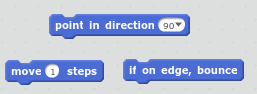
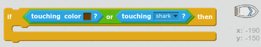

\--- meydan okuma \---

## Zorluk: Daha fazla engel!

Oyununuza daha fazla engel ekleyebilir misiniz? İşte bazı fikirler:

\--- görev \---

Arka planınıza yeşil çamur ekleyebilir ve oyunda değişiklikler yapabilir, böylece oyuncu, oyuncuların dokunmalarına izin verdiği zaman, balçık tekneyi yavaşlatır.

\--- ipuçları \--- \--- ipucu \--- Bunu yapmak için `bekleme` bloğu kullanabilirsiniz:  \--- / ipucu \--- \--- / ipuçları \---

\--- /görev \---

\--- görev \---

Günlük veya köpekbalığı gibi hareketli bir nesne ekleyebilirsiniz!

\--- ipuçları \--- \--- ipucu \--- Bu bloklar yeni nesneyi hareket ettirmenize yardımcı olabilir:

Yeni nesneniz kahverengi değilse, tekne kodunuzu eklemeniz gerekir:

 \--- / ipucu \--- \--- / ipuçları \---

\--- /görev \---

\--- /meydan okuma \---