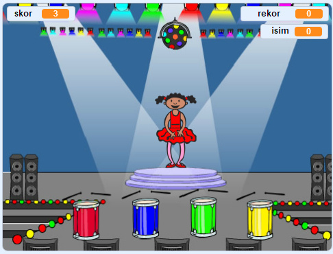

## Sırada ne var?

'Tekne yarışı' projesini tamamladığınız için tebrikler! Biraz daha zor bir şey denemek ister misiniz?

[Hafıza](https://projects.raspberrypi.org/en/projects/memory?utm_source=pathway&utm_medium=whatnext&utm_campaign=projects) projesini deneyebilirsin.

\--- no-print \---

Başlamak için yeşil bayrağı tıklayın. Dansçının elbisesi tarafından gösterilen renklerin sırasını izleyin ve beraberindeki davul ritimlerini dinleyin, ardından renkleri tekrar ona tekrarlayın. Renklerin sırasını yanlış anlarsan, oyun biter!

  <iframe allowtransparency="true" width="485" height="402" src="//scratch.mit.edu/projects/embed/284452634/?autostart=false" frameborder="0" allowfullscreen scrolling="no"></iframe> 

\--- /no-print \---

\--- print-only \---

\--- /print-only \---