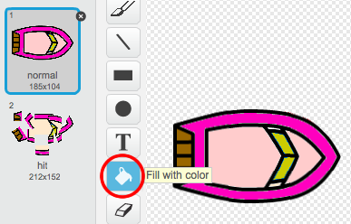
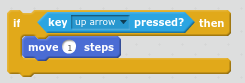

\--- meydan okuma \---

## Zorluk: Daha fazla tekne!

Oyununuzu 2 oyuncu arasındaki bir yarışa dönüştürebilir misiniz? İkinci oyuncu, ilerlemek için yukarı okunu ve dönüş için sol ve sağ ok tuşlarını kullanarak teknelerini kontrol etmelidir.

\--- ipuçları \--- \--- ipucu \--- Tekneyi kopyalayın ve teknenin rengini değiştirin2.

 \--- / ipucu \--- \--- ipucu \--- Bu kodu değiştirerek iki teknenin farklı yerlerde başlamasını sağlayın:

 \--- / ipucu \--- \--- ipucu \--- Fareyi kullanan ve ok tuşlarını kullanarak tekne2'yi kontrol etmek için kodla değiştirilen boat2 kodunu silin. \--- / ipucu \--- \--- ipucu \--- Bu, boat2'yi ilerletmek için gerek duyacağınız kod:

 \--- / ipucu \--- \--- ipucu \--- Ayrıca sol ve sağ ok tuşlarına basıldığında tekneyi *tur* kodlamanız gerekecektir. \--- / ipucu \--- \--- / ipuçları \---

\--- /meydan okuma \---