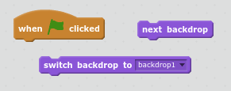

 [Çevrimdışı Tamamlanmış Proje] (kaynaklar / BoatRace-Finished.sb2) {: indir = 'BoatRace-Finished.sb2'} [Çevrimiçi Tamamlanan Proje] (http://scratch.mit.edu/projects/63957956/#editor) { : hedef = "_ blank"}

\--- meydan okuma \---

## Zorluk: Daha fazla seviye!

Daha fazla arka plan oluşturabilir ve oyuncu seviyeleri arasında seçim yapabilir misiniz?

\--- ipuçları \--- \--- ipucu \---  \--- / ipucu \--- \--- / ipuçları \---

\--- /meydan okuma \---