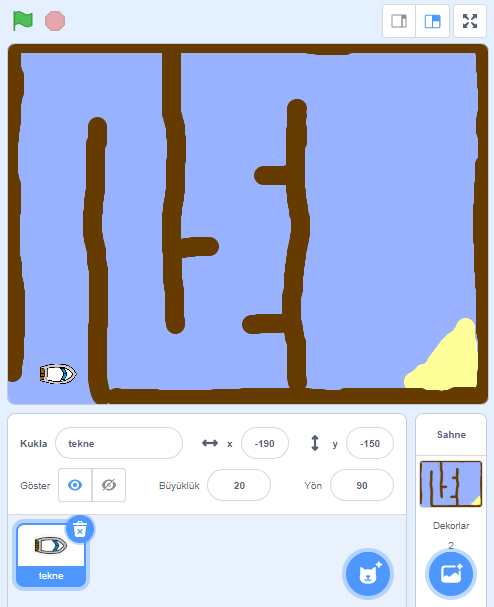

## Başlamak

\--- görev \---

Başlangıç ​​projesini açın.

## \--- çöküş \---

başlık: Scratch'ı çevrimiçi kullanıyorum

## resim: resimler / resim.png

'Boat Race' Scratch başlangıç ​​projesini [jumpto.cc/boat-go](https://scratch.mit.edu/projects/63958014/#editor){: target = "_ blank"} 'da açın. \--- /çöküş \---

## \--- çöküş \---

başlık: Scratch çevrimdışı kullanıyorum

## resim: resimler / resim.png

'Boat Race' Scratch başlangıç ​​projesini [jumpto.cc/boat-get](http:jumpto.cc/boat-get){: target = "_ blank"} sayfasından indirin ve ardından çevrimdışı düzenleyiciyi kullanarak açın. \--- /çöküş \---

\--- /görev \---

\--- görev \---

Proje bir tekne sprite ve aşağıdakileri içeren bir kurs zemini içeriyor:

- Teknenizin kaçınmak zorunda olduğu odun
- Teknenin almak zorunda olduğu çöl adası.
    
    

\--- /görev \---