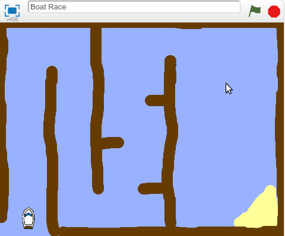

## Tekneyi kontrol etme

Oyuncu fare ile tekne görüntüsünü kontrol eder.

--- task ---

Tekneye, sol alt köşede başlayıp ardından fare imlecini takip edeceği kodu ekleyin.


```blocks3
when flag clicked
point in direction (0)
go to x: (-190) y: (-150)
forever
point towards (mouse-pointer v)
move (1) steps
```

--- /task ---

--- task ---

Yeşil bayrağa tıklayın ve fareyi hareket ettirerek **kodunuzu test edin**. Tekne sprite'ı fare imlecine doğru hareket ediyor mu?


--- no-print ---



--- /no-print ---

--- print-only ---


--- /print-only ---

--- /task ---

--- task ---

Tekne fare imlecine ulaşırsa ne olur? Dene ve sorunun ne olduğunu gör.

--- /task ---

--- task ---

Bunun gerçekleşmesini önlemek için, bir `eğer`{:class="block3control"} bloğu ekleyin, böylece tekne görüntüsü, fare imlecinden en az 5 piksel uzakta olduğu sürece hareket eder.

--- hints ---
 --- hint ---

Tekne sadece fare imlecine doğru hareket etmeli. Bu yüzden `eğer`{:class="block3control"} `fare imlecine olan uzaklık`{:class="block3sensing"}, `5 pikselden büyük ise`{:class="block3operators"} bloğunu taşıyın.

--- /hint --- 
--- hint ---

Tekne görüntüsü için kodunuza eklemeniz gereken bloklar şunlardır:


```blocks3
if < [ ] > [ ] > then

(distance to (mouse-pointer v))
```

--- /hint --- 
--- hint ---

Kodunuz şöyle görünmelidir:


```blocks3
when flag clicked
point in direction (0)
go to x: (-190) y: (-150)
forever
if <(distance to (mouse-pointer v)) > [5]> then
point towards (mouse-pointer v)
move (1) steps
```

--- /hint ------ /hints ---

--- /task ---

--- task ---

Sorunun çözülüp çözülmediğini kontrol etmek için kodunuzu tekrar test edin.

--- /task ---