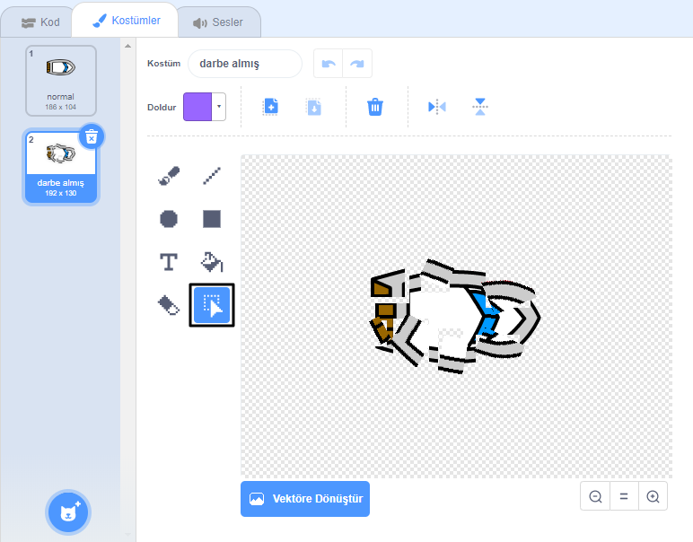
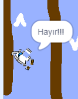

## Çarpışma!

Şu anda, tekne sprite ahşap engellerin üzerinden kolayca yelken açabilir! Bunu şimdi düzelteceksin.

\--- task \---

Tekne sprite için iki kostüm gerekir: biri normal kostüm, diğeri tekne çöktüğünde. Tekne sprite kostümünü çoğaltın ve bir kostüme 'normal' ve diğer 'isabet' adını verin.

\--- /task \---

\--- task \---

'Hit' kostümünüzü tıklayın ve kostümün parçalarını almak için **Select** aracını kullanın ve teknenin parçalara çarpmış gibi görünmesi için onları hareket ettirin ve döndürün.



\--- /görev \---

\--- task \---

Şimdi teknenize kod ekleyin; böylelikle kahverengi ahşap bariyerlere dokunduğunda çarpar ve kırılır.

\--- ipuçları \--- \--- ipucu \--- İçinde kod blokları eklemeniz gerekir senin `sonsuza`{: class = "block3control"} döngü, kod tekne sprite çöktü olmadığını kontrol eder, böylece ve eğer kilitlenmişse, kodun sprite pozisyonunu sıfırlaması gerekir.

`ise`{: class = "block3control"} teknedir `dokunmadan`{: class = "block3sensing"} yapmanız gerekenler ahşap kahverengi renk `isabet kostüm geçiş`{: class = "block3looks"} , `diyor Noooo! 2 saniye boyunca`{: class = "block3looks"} ve sonra `normal kostüm`geri dönün {: class = "block3looks"}. Son olarak, `yukarı`{: class = "block3motion"} ve `başlangıç noktasına`{: class = "block3motion"} gidin.

\--- / hint \--- \--- hint \--- İhtiyacınız olan kod blokları: 

```blocks3
eğer <touching color [ ] ?> sonra
son

, x: (-190) y: (-150)

geçiş kostümü (v) v yönünde

nokta (0)

geçiş kostümü (normal v)

deyin, (2 saniye
```

\--- / ipucu \--- \--- ipucu \--- Kodunuzun nasıl görünmesi gerektiği: 

```blocks3
bayrak (0)
yönünde
noktaya tıklandığında x: (-190) y: (-150)
sonsuza
eğer <((fare imleci v)) > [5]> sonra
noktaya (fare- işaretçi v)
hareket (1) adım
ucu
ise <touching color [#663b00] ?> daha sonra
(v) 'vurmak için anahtar kostüm
demek [Noooooo!] (2) saniye için
(normal v) geçiş kostüm
yönünde alanına (0)
x'e git: (-190) y: (-150)
sonuç
```

\--- / ipucu \--- \--- / ipuçları \---

\--- /task \---

\--- task \---

Tekne sprite'ınızın her zaman 'normal' görünmeye başladığından emin olmak için kod eklemelisiniz.

Kodunuzu tekrar test edin. Tekneyi şimdi tahta bir bariyerden açmaya çalışırsanız, tekne çarpmalı ve ardından başlangıç pozisyonuna dönmelidir.



\--- /task \---