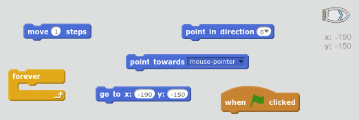
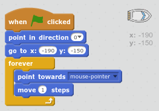
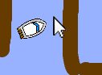
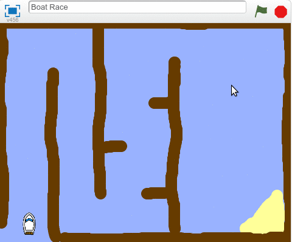
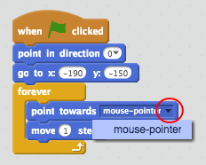
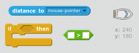
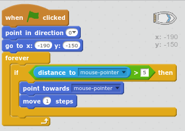

## Tekneyi kontrol etmek

\--- görev \---

Botu fare ile kontrol edeceksin. Teknenize kod ekleyin, böylece sol alt köşede başlayacak ve ardından fare imlecini takip edecektir. **Yapmanız gereken şeyi yaptığından emin olmak için kodunuzu** test edin.

\--- ipuçları \--- \--- ipucu \--- Bir kere `yeşil bayrak tıklandığında`, kendi tekne yapmak gerekir `başlangıç pozisyonuna gitmek` ve `yukarı noktasında`. Sonraki gerekeceðini `fare işaretçisi doğru alanına` ve `hareket 1 basamak`. Sonsuza kadar bu `tekrarlamak gerekecek`.

\--- / ipucu \--- \--- ipucu \--- İhtiyacınız olacak kod blokları:  \--- / ipucu \--- \--- ipucu \--- Kodunuz şöyle olmalıdır:  \--- / ipucu \--- \--- / ipuçları \---

\--- /görev \---

\--- görev \---

Bayrağını tıklatarak ve fareyi hareket ettirerek teknenizi test edin. Tekne fareye doğru gidiyor mu?

## \--- çöküş \---

başlık: Sorunlarınız varsa ...

## resim: resimler / resim.png

**Not:** Scratch'da şu anda bir hata var, yani tekneniz fare işaretçisine doğru hareket etmeyebilir. Bu olursa, `noktasında` bloğa doğru oku tıklayın ve `fare işaretçisi`tekrar seçin.

 \--- /çöküş \---

\--- /görev \---

\--- görev \---

Tekne fare işaretçisine ulaşırsa ne olur? Dene.

\--- /görev \---

\--- görev \---

Bunun olmasını engellemek için, kodunuza `veya` blok eklemeniz gerekir, böylece tekne yalnızca fareden 5 pikselden daha uzaktaysa hareket eder.

\--- tavsiyeleri \--- \--- ipucu \--- sadece fare işaretçisi tarafına doğru ve hareket etmelidir tekne `ise` `fare işaretçisi mesafe` olan `5 pikselden fazla`. \--- / ipucu \--- \--- ipucu \--- İşte teknenin koduna eklemeniz gereken kod blokları:  \--- / ipucu \--- \--- ipucu \--- Bu kodunuzun nasıl görünmesi gerektiği:  \--- / ipucu \--- \--- / ipuçları \---

\--- /görev \---

\--- görev \---

Sorunun giderilip giderilmediğini kontrol etmek için teknenizi tekrar test edin.

\--- /görev \---