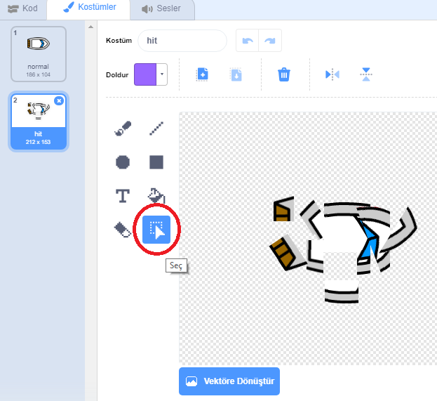
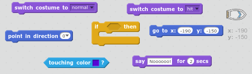
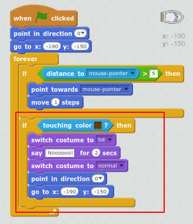

## Çökme!

Şu anda, tekneniz ahşap engellerden geçebilir! Bunu düzelelim.

\--- görev \---

Tekneniz için iki kostüm, bir normal kostüm ve teknenin çökmesi için bir tane gerekir. Tekne kostümünüzü kopyalayın ve bir kostümü 'normal' ve diğerini 'vurun' olarak adlandırın.

\--- /görev \---

\--- görev \---

'Hit' kostümünüzü tıklayın ve teknenin bitlerini yakalamak için Seçme aracını seçin ve düştüğü gibi görünmesini sağlamak için onları hareket ettirin ve döndürün.

\--- /görev \---

\--- görev \---

Şimdi teknenize kod ekleyin, böylece herhangi bir kahverengi ahşap bitine dokunduğunda çöker ve kırılır.

\--- ipuçları \--- \--- ipucu \--- `sonsuza kadar` döngüsünün içine kod eklemeniz gerekir, böylece kodunuz çöktüğünde kodunuzu kontrol etmeye devam eder. `ise` tekne olup `dokunmadan` ahşap kahverengi renk yapmanız gerekenler `isabet kostüm geçiş`, `Noooo demek! 2 saniye`ve sonra `normal kostüm`geri döner. Son olarak, şunları yapmanız gerekir `noktasına kadar` ve `başlangıç pozisyonuna gitmek`. \--- / ipucu \--- \--- ipucu \--- İhtiyacınız olacak kod blokları:  \--- / ipucu \--- \--- ipucu \--- İşte kodunuzun nasıl görünmesi gerektiği:  \--- / ipucu \--- \--- / ipuçları \---

\--- /görev \---

\--- görev \---

Ayrıca teknenizin daima “normal” görünmeye başladığından emin olmalısınız.

Şimdi ahşap bir bariyere yelken açmaya çalışırsanız, teknenizin çöktüğünü ve başlangıca geri döndüğünü görmelisiniz.

\--- /görev \---