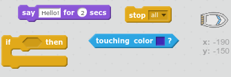
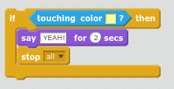

## Meydan okuma: kazanma!

Başka ekleyebilir `ise` çöl adaya gidince oyuncu kazanır anlaşılması için, teknenin koduna deyimi?

Tekne sarı çöl adasına gittiğinde, oyun 'YEAH!' ve sonra durmalı.

\--- ipuçları \--- \--- ipucu \--- `sonsuza kadar` döngüsünün içine kod eklemeniz gerekir, böylece oyuncu kazanırsa kodunuzu kontrol eder. `ise` tekne olup `dokunmadan` hazine adanın renkli yapmanız gerekenler `demek 'Evet!' 2 saniye` ve daha sonra `oyunu bitirmek için tüm` durdurmak. \--- / ipucu \--- \--- ipucu \--- İhtiyacın olacak kod blokları:  \--- / ipucu \--- \--- ipucu \--- İşte kodunuzun nasıl görünmesi gerektiği: 

Unutmayın ki yeni kod `sonsuza kadar` döngü içinde olmalıdır. \--- / ipucu \--- \--- / ipuçları \---