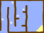
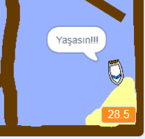

## Zamanlayıcı eklemek

Artık oyununuza bir zamanlayıcı ekleyeceksiniz, böylece oyuncu adaya mümkün olduğu kadar çabuk ulaşmak zorunda.

\--- task \---

Sahne Alanı'na `kez`{: class = "block3variables"} adlı yeni bir değişken ekleyin.


[[[generic-scratch3-add-variable]]]

Yeni değişkeninizin görüntülenme şeklini değiştirerek zamanlayıcınıza bir görünüm de seçebilirsiniz.

\--- /task \---

\--- task \---

Şimdi Sahne Alanı'na kod blokları ekleyin, böylece tekne adaya ulaşana kadar zamanlayıcı sayılır.

\--- hints \--- \--- hint \---

On the Stage, `when the green flag is clicked`{:class="block3control"}, `set the time to 0`{:class="block3variables"}. Inside your `forever`{:class="block3control"} loop, you'll need to first `wait 0.1 secs`{:class="block3control"}, then `change the time by 0.1`{:class="block3variables"}.

\--- /hint \--- \--- hint \---

Here are the code blocks you'll need:



```blocks3
(0.1) [zaman v] yerine

bayrak tıklandığında

sonsuza
uca

bekleme (0.1) saniye

set [zaman v] [0]
```

\--- /hint \--- \--- hint \---

Here's what your new code should look like:


```blocks3
bayrak
tıklandığında [zaman v] 'nin sonsuza kadar [0]
olmasını sağlayın
bekleyin (0.1) saniye
[zaman v]' ı (0.1)

```

\--- /hint \--- \--- /hints \---

\--- /task \---

\--- task \---

Test out your game and see how quickly you can get the boat to the island!



\--- /task \---