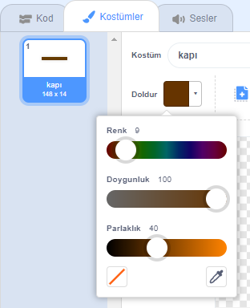

## Engeller ve güçlendiriciler

Şu anda oyun **far** çok kolay, bu yüzden daha ilginç hale getirmek için bazı şeyler katacak.

İlk önce, tekneyi hızlandırmak için bazı güçlendiriciler ekleyeceksiniz.

\--- task \---

Bazı beyaz güçlendirici oklar ekleyerek Sahne Alanı düzeninizi düzenleyin.


\--- /task \---

\--- task \---

Şimdi teknenizin `sonsuza`koduna daha fazla kod bloğu ekleyin. {: Class = "block3control"} döngü. 

```blocks3
<touching color [#FFFFFF] ?> ise
hamle (3) adım
sonu
```

\--- /task \---

\--- task \---

Yeni yükseltici okların tekneyi hızlandırıp hızlandırmadığını görmek için oyununuzu test edin.

\--- /task \---

Sonra, teknenin kaçınması gereken bir dönüş kapısı ekleyeceksiniz.

\--- task \---

Buna benzeyen yeni bir sprite ekleyin ve buna 'kapı' diyor


Geçit sprite renginin ahşap bariyerlerin rengiyle aynı olduğundan emin olun.



\--- /task \---

\--- task \---

Make sure that the centre of the gate sprite is positioned in the middle.


\--- /task \---

\--- task \---

Add code to your gate sprite to make it spin slowly forever.

\--- hints \--- \--- hint \--- Add code blocks to the gate sprite so that it `turns 1 degree`{:class="block3motion"} `forever`{:class="block3control"}. \--- /hint \--- \--- hint \--- Here are the code blocks you need: 

```blocks3
sonsuza kadar
son

bayrak tıklandığında cw (1) derece

döndür
```

\--- /hint \--- \--- hint \--- Here's what your new code should look like: 

```blocks3
bayrak
sonsuza dek
tıklatıldığında cw (1) derece
son
```

\--- /hint \--- \--- /hints \---

\--- /task \---

\--- task \---

Test your game again. You should now have a spinning gate that you need to stir your boat around.


\--- /task \---