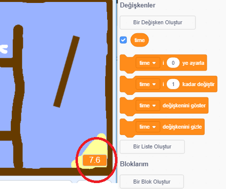
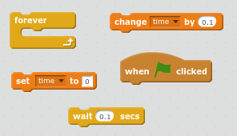
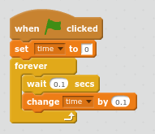

## Deneme süresi

Oyununuza bir zamanlayıcı ekleyelim, böylece oyuncu çöl adasına mümkün olduğu kadar çabuk ulaşmak zorunda.

\--- görev \---

Sahneye `zaman` denen yeni bir değişken ekleyin. Yeni değişkeninizin görünümünü de değiştirebilirsiniz.

[[[generic-scratch-add-variable]]]

\--- /görev \---

\--- görev \---

Artık, Sahne Alanı'nıza kod ekleyin, böylece tekne ıssız adaya ulaşana kadar zamanlayıcı sayar.

\--- ipuçları \--- \--- ipucu \--- Alanı'nda, `yeşil bayrak tıklandığında`, `0'a zamanını ayarlamak`. Senin İçerisinde `sonsuza` blokta, ilk gerekir `bekleme 0.1 sn`, sonra `değişikliği 0.1 ile süresi`. \--- / ipucu \--- \--- ipucu \--- İhtiyacınız olacak kod blokları:  \--- / ipucu \--- \--- ipucu \--- İşte kodunuzun nasıl görünmesi gerektiği:  \--- / ipucu \--- \--- / ipuçları \---

\--- /görev \---

\--- görev \---

Bu kadar! Oyununuzu test edin ve ıssız adaya ne kadar hızlı gidebileceğinizi görün!

\--- /görev \---