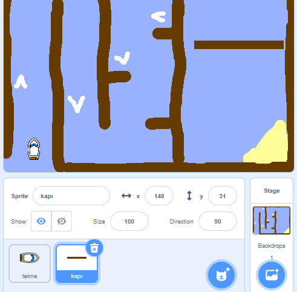

## Engeller ve güçlendiriciler

Şu anda oyun **oldukça** kolay, bu yüzden daha ilginç hale getirmek için bazı şeyler katacaksınız.

İlk önce, tekneyi hızlandırmak için bazı güçlendiriciler ekleyeceksiniz.

--- task ---

Bazı beyaz güçlendirici oklar ekleyerek Sahne dekorunuzu düzenleyin.


--- /task ---

--- task ---

Şimdi teknenizin `sürekli tekrarla`{:class="block3control"} döngüsüne daha fazla kod bloğu ekleyin ve böylece tekne kuklası beyaz oka dokunduğunda üç adım fazladan hareket eder.


```blocks3
if <touching color [#FFFFFF] ?> then
move (3) steps
end
```

--- /task ---

--- task ---

Yeni hızlandırıcı oklarınızın tekneyi hızlandırıp hızlandırmadığını görmek için oyununuzu test edin.

--- /task ---

Sonra teknenin kaçınması gereken bir dönen kapı ekleyeceksiniz.

--- task ---

Buna benzeyen yeni bir kukla ekleyin ve 'kapı' olarak adlandırın:



Kapı kuklasının renginin ahşap bariyerlerin rengiyle aynı olduğundan emin olun.


--- /task ---

--- task ---

Kapı kuklasının ortaya yerleştirildiğinden emin olun.


--- /task ---

--- task ---

Sonsuza kadar yavaşça dönmesi için kapı kuklanıza kod ekleyin.

--- hints ---
 --- hint ---

`Sonsuza kadar`{:class="block3control"} `1 derece döndür`{:class="block3motion"} mek için kapı kuklasına kod blokları ekleyin.

--- /hint --- --- hint ---

İhtiyacınız olan kod blokları:


```blocks3
forever
end

turn cw (1) degrees

when flag clicked
```

--- /hint --- --- hint ---

Yeni kodunuz şöyle görünmelidir:


```blocks3
when flag clicked
forever
turn cw (1) degrees
end
```

--- /hint ------ /hints ---

--- /task ---

--- task ---

Oyununuzu tekrar test edin. Şimdi teknenizi etrafından geçirmeniz gereken bir dönen kapınız olmalı.


--- /task ---