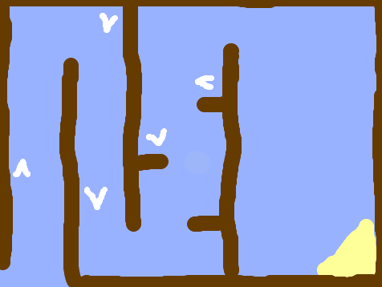
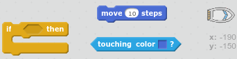
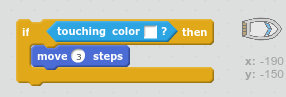
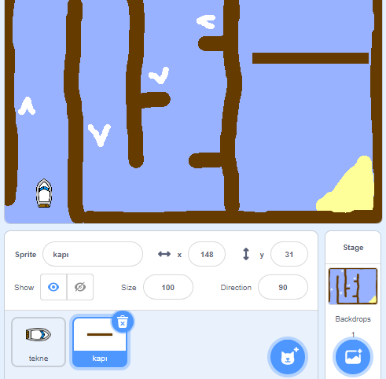
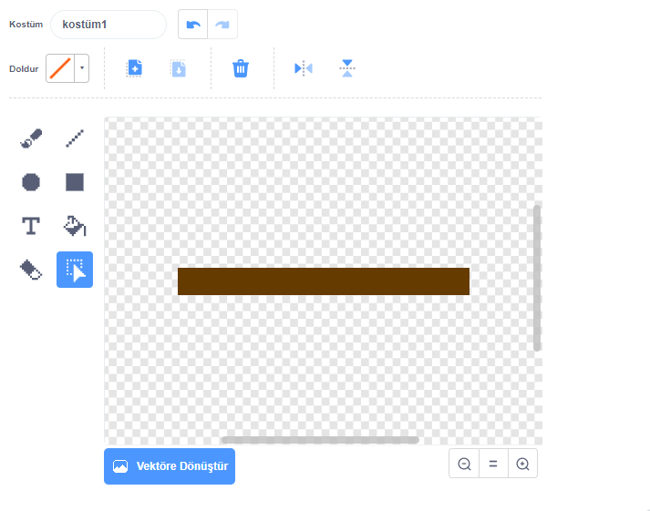
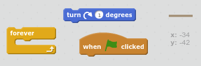
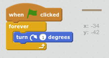
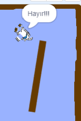

## Engeller ve güç kaynakları

Şu anda bu oyun *uzak* çok kolay - daha ilginç hale getirmek için şeyler ekleyelim.

\--- görev \---

Teknenizi hızlandırmak için ilk önce oyununuza biraz 'destek' ekleyelim. Sahne arka planınızı düzenleyin ve bazı beyaz güçlendirici okları ekleyin.

\--- /görev \---

\--- görev \---

Şimdi teknenizin sonsuza kadar döngüsüne biraz kod ekleyin, böylece beyaz bir güçlendiriciye dokunduğunda üç ekstra adım hareket ettirin.

\--- ipuçları \--- \--- ipucu \--- `ise` tekne ise `beyaz güçlendirici dokunmadan`daha sonra, gereken `hareket 3 ekstra adımlar`.  
\--- / ipucu \--- \--- ipucu \--- İhtiyacınız olacak kod blokları:  \--- / ipucu \--- \--- ipucu \--- İşte kodunuz şöyle olmalıdır:  \--- / ipucu \--- \--- / ipuçları \---

\--- /görev \---

\--- görev \---

Ayrıca teknenizin kaçınmak zorunda kalacağı bir eğirme kapısı da ekleyebilirsiniz. Buna benzeyen 'geçit' adında yeni bir hareketli grafik ekleyin:

Kapının renginin ahşap bariyerinkiyle aynı olduğundan emin olun.

\--- /görev \---

\--- görev \---

Kapı hareketinin merkezini ayarlayın.

\--- /görev \---

\--- görev \---

Sonsuza dek yavaşça dönmesini sağlamak için kapınıza kod ekleyin.

\--- ipuçları \--- \--- ipucu \--- o böylece kapı sprite kodu ekleyin `1 derece döner` `sonsuza`. \--- / ipucu \--- \--- ipucu \--- İhtiyacınız olacak kod blokları:  \--- / ipucu \--- \--- ipucu \--- İşte kodunuzun nasıl görünmesi gerektiği:  \--- / ipucu \--- \--- / ipuçları \---

\--- /görev \---

\--- görev \---

Oyununu test et. Artık kaçınmanız gereken bir iplik kapısına sahip olmalısınız.

\--- /görev \---