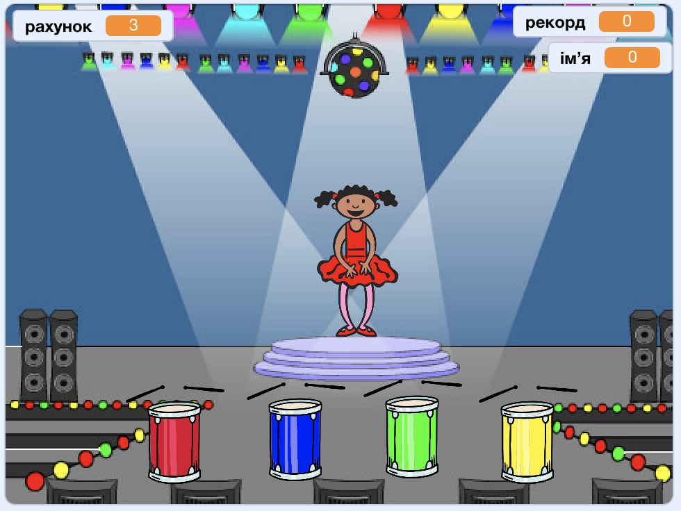

## Що далі?

Вітаємо із завершенням проєкту "Перегони човнів"! Чи хочеш ти спробувати щось трішечки складніше?

Ти можеш спробувати проєкт [Пам’ять](https://projects.raspberrypi.org/en/projects/memory?utm_source=pathway&utm_medium=whatnext&utm_campaign=projects).

\--- no-print \---

Натисни на зелений прапор для запуску. Слідкуй за послідовністю кольорів плаття танцівниці і слухай супутні удари барабана, а далі відтвори кольори в тій же послідовності. Якщо ти переплутаєш їх порядок, то гра закінчиться!

  <iframe allowtransparency="true" width="485" height="402" src="//scratch.mit.edu/projects/embed/284452634/?autostart=false" frameborder="0" allowfullscreen scrolling="no" mark="crwd-mark"></iframe> 

\--- /no-print \---

\--- print-only \---

\--- /print-only \---