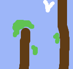

\--- challenge \---

## Challenge: більше перешкод!

Чи можна додати більше перешкод для вашої гри? Ось деякі ідеї:

\--- task \---

Ви можете додати зеленого слизу до свого фону та внести зміни до гри, щоб слиз вповільнив човен, коли гравець дозволяє торкатися.

\--- hint \--- \--- hint \--- Ви можете використовувати `час` блок, щоб зробити це:  \--- /hint \--- \--- /hints \---

\--- /task \---

\--- task \---

Ви можете додати рухомий об'єкт, як колода або акула!

\--- hints \--- \--- hint \--- Ці блоки допоможуть вам рухати нові об'єкти:

Якщо ваш новий об'єкт не коричневий, вам потрібно додати його до коду корабля:

 \--- /hint \--- \--- /hints \---

\--- /task \---

\--- /challenge \---