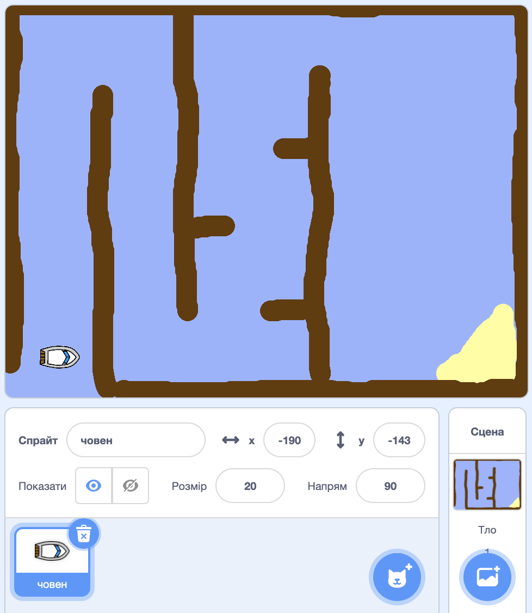

## Розпочнемо

\--- завдання \--- Відкрити стартовий проект.

**Online:** відкрийте онлайн-проект стартера за адресою [rpf.io/boat-race-starter-on](http://rpf.io/boat-race-starter-on){: target = "_ blank"} і натисніть **Remix**.

**Офлайн:** завантажте автономний початковий проект з [rpf.io/p/en/boat-race-get](http://rpf.io/p/en/boat-race-get){: target = "_ blank"}, а потім відкрийте його за допомогою автономного редактора.

Якщо потрібно завантажити та встановити редактор Scratch offline, його можна знайти за адресою [rpf.io/scratchoff](http://rpf.io/scratchoff). \--- / завдання \---

\--- task \---

Проект включає в себе спрайт з човна, а також фоновий режим з:

- Дереву, яку повинен уникати спрайт судна
- Безлюдний острів, до якого повинен дістатися човен
    
    

\--- /task \---