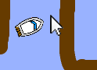

## Контроль човна

Гравець керуватиме спрайтом човна за допомогою миші.

\--- завдання \--- Додайте код до спрайту човна, щоб він починався в нижньому лівому куті, спрямованому вгору, а потім за курсором миші.


```blocks3
коли прапорець натиснув
в напрямку (0)
перейдіть на x: (-190) y: (-150)
назавжди
точки на (вказівник миші v)
кроки (1)
```

\--- /task \---

\--- task \---

**Перевірте код** , натиснувши на зелений прапор і перемістивши мишу. Чи спрайт судна рухається до покажчика миші?



\--- без друку \---  \--- / без друку \---

\--- тільки для друку \---  \--- / тільки для друку \---

\--- /task \---

\--- task \---

Що відбувається, коли судно досягає вказівника миші? Спробуйте з'ясувати, в чому проблема.

\--- /task \---

\--- task \---

Щоб припинити це, потрібно додати блоку `якщо`{: class = "block3control"} у ваш код, щоб спрайт судна рухався, лише якщо він більше 5 пікселів від покажчика миші.

\--- підказки \--- \--- натяк \--- Човен повинен тільки вказати вказівник миші і перемістити `якщо`{: class = "block3control"} `відстані до покажчика миші`{: class = "block3sensing"} `більше 5 пікселів`{: class = "block3operators"}. \--- / підказка \--- \--- натяк \--- Ці блоки коду потрібно додати до коду для спрайту човна: 

```blocks3
якщо < [] > [] > то

(відстань до (курсор миші v))
```

\--- / підказка \--- \--- натяк \--- Ось так має виглядати ваш код: 

```blocks3
коли прапор натиснув
точку в напрямку (0)
перейти до х: (-190) у: (-150)
назавжди
, якщо <(відстань до (миші-покажчика V)) > [5]> потім
точок в напрямку (миша- вказівник v)
переміщення (1) кроків
```

\--- /hint \--- \--- /hints \---

\--- /task \---

\--- task \---

Перевірте свій код ще раз, щоб перевірити, чи виправлена проблема.

\--- /task \---