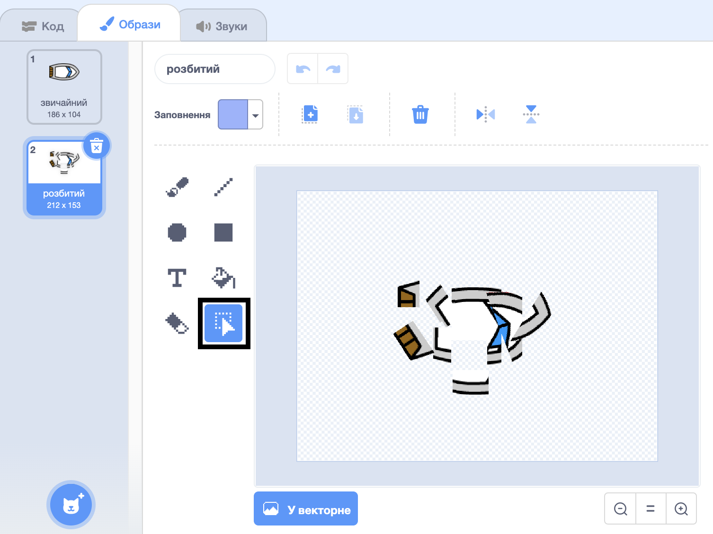

## Аварія!

На даний момент спрайт з човна може просто плисти по дерев'яних перешкодах! Тепер ви збираєтеся це виправити.

\--- task \---

Вам знадобляться два костюми для вашого спрайта на човні: один звичайний костюм, і один для того, коли човен аварії. Дублюйте костюм спрайту вашого судна, і назвіть один костюм "нормальний", а другий - "хіт".

\--- /task \---

\--- task \---

Натисніть на свій «хіт» костюм, і використовуйте **Виберіть** інструмент для захоплення частини костюма і переміщати і обертати їх , щоб зробити зовнішній вигляд човна , як він розбився на шматки.



\--- /task \---

\--- task \---

Тепер додайте код до свого човна так, щоб він зривався і розпадався, коли він торкався будь-яких коричневих дерев'яних бар'єрів.

\--- підказки \--- \--- натяк \--- Вам потрібно додати блокові коди всередині циклу `назавжди`{: class = "block3control"}, щоб ваш код продовжував перевіряти, чи спрайт судна розбився, і якщо він зазнав аварії, код повинен скинути позицію спрайта.

`якщо`{: class = "block3control"} човен `дотик`{: class = "block3sensing"} коричневий колір деревини, потрібно `перейти на хіт костюм`{: class = "block3looks"} , `сказати Noooo! протягом 2 секунд`{: class = "block3looks"}, а потім `перейти назад до нормального костюма`{: class = "block3looks"}. Нарешті, вам потрібно буде `балів до`{: class = "block3motion"} і `перейти в початкову позицію`{: class = "block3motion"}.

\--- / підказка \--- \--- натяк \--- Ось вам потрібні блоки коду: 

```blocks3
якщо <touching color [ ] ?> , то
кінець

перейти до х: (-190) у: (-150)

перемикача костюм , щоб (вдарив v)

точки в напрямку (0)

Перемикач костюм (з нормальною V)

говорять [Noooooo!] для (2) секунд
```

\--- / підказка \--- \--- натяк \--- Ось як повинен виглядати ваш код: 

```blocks3
коли прапорець натиснув
в напрямку (0)
перейдіть на x: (-190) y: (-150)
назавжди
якщо <(відстань до (вказівник миші v)) > [5]> потім
напрямку (миша вказівник v)
переміщення (1) кроки
кінець
якщо <touching color [#663b00] ?> потім
перемикання костюм на (удар v)
сказати [Noooooo!] протягом (2) секунди
перейти костюм до (нормальний v)
точок у напрямку (0)
перейти до x: (-190) y: (-150)
кінець
```

\--- /hint \--- \--- /hints \---

\--- /task \---

\--- task \---

Також потрібно додати код, щоб переконатися, що спрайт вашого судна завжди починається з "нормального".

Перевірте свій код знову. Якщо ви спробуєте проплисти човен через дерев'яний бар'єр, то човен повинен впасти, а потім повернутися до вихідного положення.


\--- /task \---