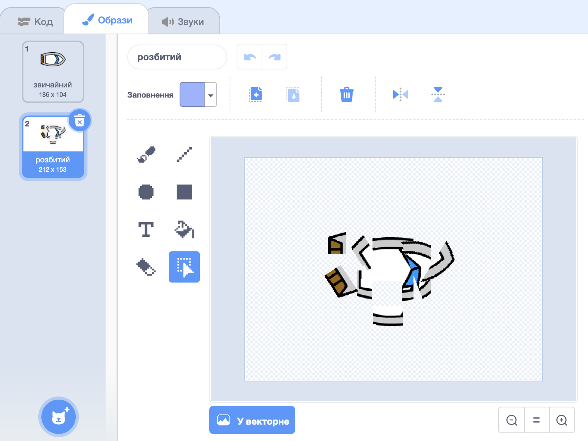

## Аварія!

На даний момент ваш човен може плисти через дерев'яні бар'єри! Виправимо це.

\--- task \---

Вам буде потрібно два вигляди для вашого човна, один звичайний, і один для аварійних ситуацій. Дублюйте їх та назвіть один з них "нормальний" та інший "аварійний".

\--- /task \---

\--- task \---

Натисніть на свій "аварійний" вигляд, і виберіть інструмент "Вибрати", щоб захопити біти човна, а потім перемістити та повернути їх, щоб виглядало так, ніби він розбився.

\--- /task \---

\--- task \---

Тепер додайте код до свого човна так, щоб він падав і розбивався, коли торкається будь-яких коричневих дерев'яних шматочків.

\--- hints \--- \--- hint \--- Вам потрібно додавати код всередину вашої `вічної` петлі, щоб ваш код завжди перевіряв, чи судно не розбилося. `Якщо` човен `торкається` коричневого кольору деревини, вам потрібно `вибрати аварійній вигляд`, ` сказати Нііі! протягом 2 секунд `, а потім `повернетеся до звичайного вигляду`. Нарешті, вам потрібно `вказувати вгору` і `переходити до початкової позиції`. \--- /hint \--- \--- hint \--- Ось кодові блоки, які вам знадобляться:  \--- /hint \--- \--- hint \--- Так має виглядати ваш код:  \--- /hint \--- \--- /hints \---

\--- /task \---

\--- task \---

Ви також повинні переконатися, що ваш човен завжди має нормальний вигляд.

Якщо ви зараз спробуєте проплисти через дерев'яний бар'єр, ви побачите, що ваш човен розбивається і повертається до початку.

\--- /task \---