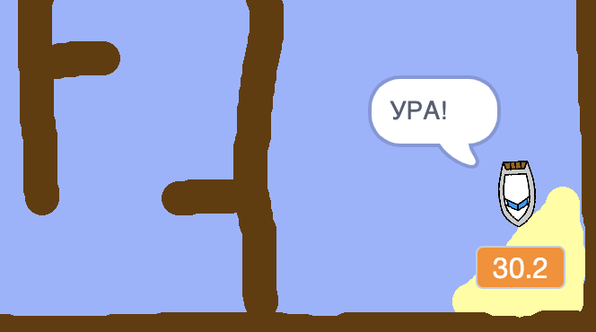

## Час судового розгляду

Давайте додамо таймер до вашої гри, щоб гравцеві потрібно було якомога швидше потрапити на острів -пустелю.

\--- task \---

Додайте нову змінну з назвою `час` на сцену. Ви також можете змінити відображення своєї нової змінної.

[[[generic-scratch-add-variable]]]

\--- /task \---

\--- task \---

Тепер додайте код до своєї сцени, щоб таймер рахував до тих пір, поки судно не досягне острова-пустелі.

\--- hints \--- \--- hint \--- На сцені, `коли зелений прапорець натиснутий`, `встановіть час на 0`. Всередині вашого `вічного` блоку, вам спочатку потрібно` зачекати 0,1 секунди`, а потім `змінити час на 0,1`. \--- /hint \--- \--- hint \--- Ось кодові блоки, які вам знадобляться:  \--- /hint \--- \--- hint \--- Так має виглядати ваш код:  \--- /hint \--- \--- /hints \---

\--- /task \---

\--- task \---

Це все! Випробуйте свою гру та подивіться, як швидко ви можете дістатися до острова-пустелі!

\--- /task \---