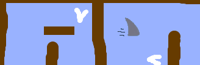

## Виклик: поліпшення своєї гри

- Ви можете додати більше перешкод у вашу гру? Наприклад, ви можете додати зелену слизу на ваш фон і внести зміни в код, щоб слиз сповільнив човен вниз, коли гравець дозволить їм торкнутися.

- Можна додати рухому перешкоду, наприклад, колоду або акулу!

- Чи можете ви перетворити вашу гру в гонку між двома гравцями? Другий гравець повинен керувати своєю судном за допомогою стрілки вгору, щоб рухатися вперед, а ліва і права клавіші зі стрілками повертаються.

- Чи можете ви створити більше рівнів, додавши різні фони, і ви зможете дозволити гравцеві вибирати між рівнями?