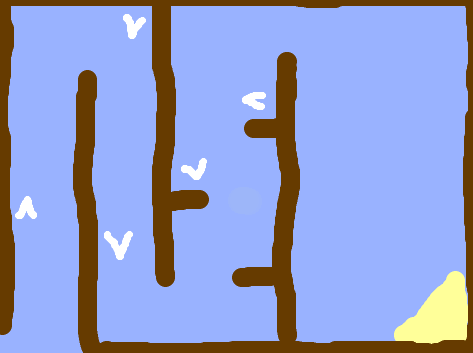
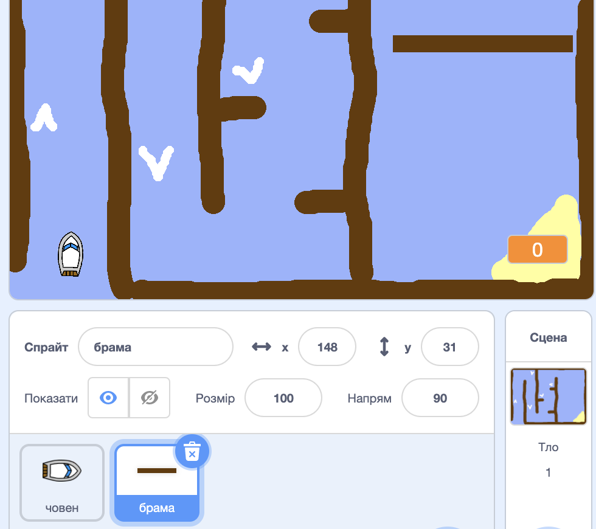
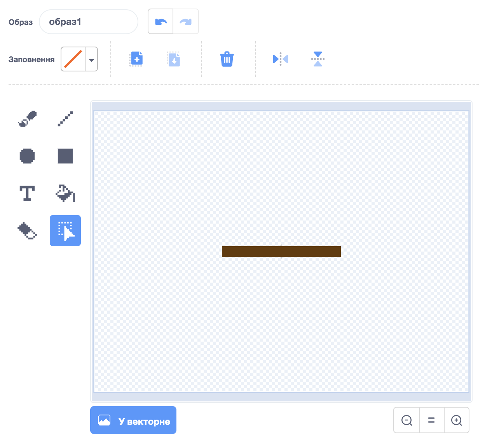

## Перешкоди і бонуси

Прямо зараз ця гра *дуже* легка - давайте додамо різні штуки, щоб зробити її більш цікавою.

\--- task \---

Давайте спочатку додамо деякі "підсилювачі" у вашу гру, щоб прискорити човен. Відредагуйте фонову роботу і додайте деякі стрілки з білим підсилювачем.

\--- /task \---

\--- task \---

Тепер додайте коди до вічного циклу вашого човна так, щоб він рухався трьома додатковими кроками, коли торкається білого підсилювача.

\--- /hint \--- \--- hint \--- `Якщо` ваш човен `торкається білого підсилювача`, тоді він повинен `рухатися трьома екстра кроками`.  
\--- /hint \--- \--- hint \--- Ось кодові блоки, які вам знадобляться:  \--- /hint \--- \--- hint \--- Так має виглядати ваш код:  \--- /hint \--- \--- /hints \---

\--- /task \---

\--- task \---

Ви також можете додати ворота, які ваш човен повинен буде уникнути. Додайте нове свідчення з назвою "gate", яке виглядає так:

Переконайтеся, що колір воріт такий же, як і в дерев'яних бар'єрах.

\--- /task \---

\--- task \---

Встановіть центр воріт.

\--- /task \---

\--- task \---

Додайте код у свої ворота, щоб він крутився повільно завжди.

\--- hints \--- \--- hint \--- Додайте код до воріт, так щоб вони `повертались на 1 градус` `завжди`. \--- /hint \--- \--- hint \--- Ось кодові блоки, які вам знадобляться:  \--- /hint \--- \--- hint \--- Так має виглядати ваш код:  \--- /hint \--- \--- /hints \---

\--- /task \---

\--- task \---

Випробуйте свою гру. Тепер ви повинні мати ворота, які слід уникати.

\--- /task \---