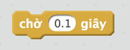
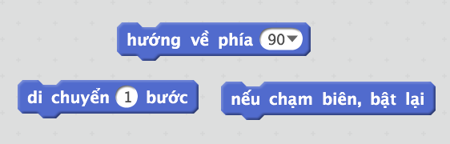
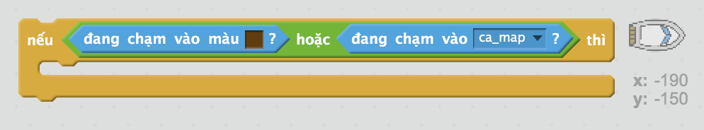

\--- challenge \---

## Thử thách: nhiều chướng ngại vật hơn!

Bạn có thể thêm nhiều chướng ngại vật hơn cho trò chơi của mình không? Đây là một số ý tưởng:

\--- task \---

Bạn có thể thêm chất nhờn màu xanh lá vào phông nền của bạn và thay đổi trò chơi để chất nhờn làm chậm thuyền khi người chơi cho chúng chạm nhau.

\--- hints \--- \--- hint \--- Bạn có thể sử dụng khối `chờ` để làm điều này:  \--- /hint \--- \--- /hints \---

\--- /task \---

\--- task \---

Bạn có thể thêm một Đối tượng có thể chuyển động như một khúc gỗ hoặc một con cá mập!

\--- hints \--- \--- hint \--- Những khối này có thể giúp bạn di chuyển Đối tượng mới của mình:

Nếu Đối tượng mới của bạn không có màu nâu, bạn sẽ cần thêm code vào thuyền của mình:

 \--- /hint \--- \--- /hints \---

\--- /task \---

\--- /challenge \---