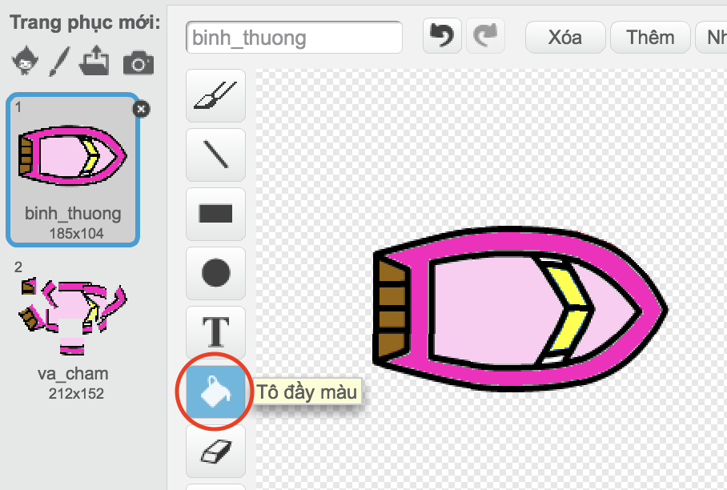
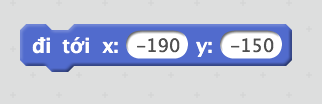
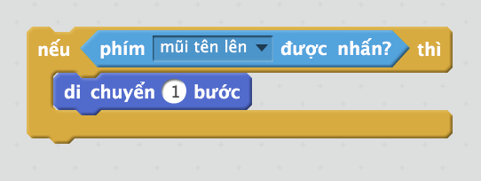

\--- thử thách \---

## Thách thức: nhiều thuyền hơn!

Bạn có thể biến trò chơi của mình thành cuộc đua giữa 2 người chơi không? Người chơi thứ hai sẽ cần phải điều khiển thuyền của họ bằng cách sử dụng mũi tên lên để di chuyển về phía trước và các phím mũi tên trái và phải để quay.

\--- gợi ý \--- \--- gợi ý \--- Sao chép thuyền và thay đổi màu sắc của boat2.

 \--- / hint \--- \--- hint \--- Làm cho hai chiếc thuyền bắt đầu ở những nơi khác nhau bằng cách thay đổi mã này:

 \--- / hint \--- \--- hint \--- Xóa mã boat2 sử dụng chuột và thay thế bằng mã để điều khiển boat2 bằng các phím mũi tên. \--- / hint \--- \--- hint \--- Đây là mã bạn sẽ cần phải di chuyển boat2 về phía trước:

 \--- / gợi ý \--- \--- gợi ý \--- Bạn cũng sẽ cần mã *chuyển* thuyền khi các phím mũi tên trái và phải được nhấn. \--- / gợi ý \--- \--- / gợi ý \---

\--- /thử thách \---