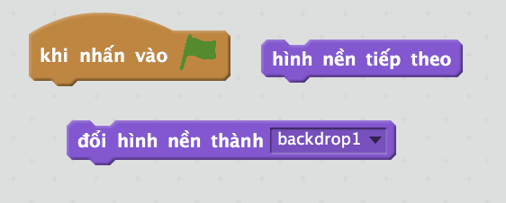

 [Dự án đã hoàn thành ngoại tuyến] (tài nguyên / BoatRace-Finished.sb2) {: download = 'BoatRace-Finished.sb2'} [Dự án hoàn thành trực tuyến] (http://scratch.mit.edu/projects/63957956/#editor) { : target = "_ blank"}

\--- thử thách \---

## Thách thức: nhiều cấp độ hơn!

Bạn có thể tạo thêm phông nền và cho phép người chơi chọn giữa các cấp không?

\--- gợi ý \--- \--- gợi ý \---  \--- / gợi ý \--- \--- / gợi ý \---

\--- /thử thách \---