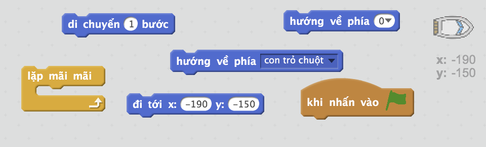
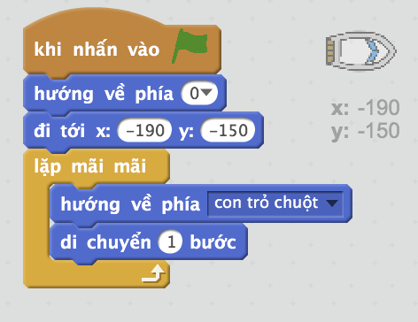
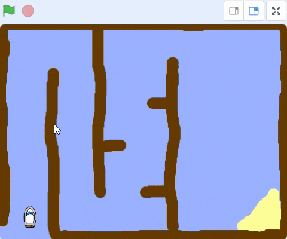
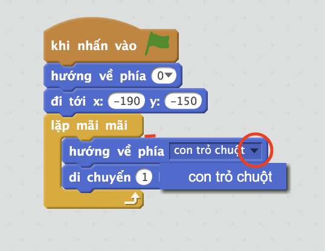
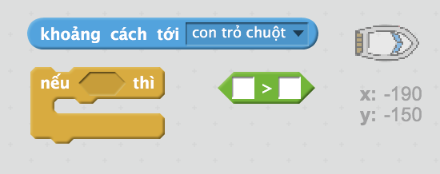
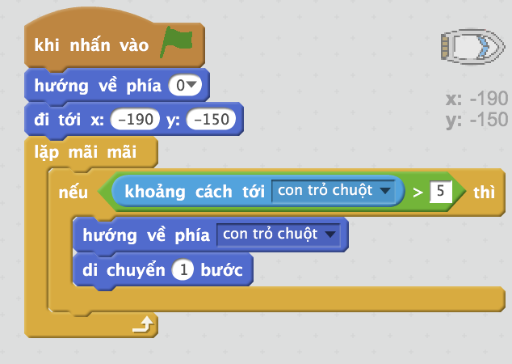

## Kiểm soát thuyền

\--- bài tập \---

Bạn sẽ điều khiển con thuyền bằng chuột. Thêm mã vào thuyền của bạn để nó bắt đầu ở góc dưới bên trái chỉ lên và sau đó đi theo con trỏ chuột. **Kiểm tra mã của bạn** để chắc chắn rằng nó làm những gì nó phải làm.

\--- gợi ý \--- \--- gợi ý \--- Khi cờ `xanh được nhấp`, bạn sẽ cần phải làm cho thuyền của bạn `đi đến vị trí bắt đầu` và `điểm lên`. Tiếp theo nó sẽ cần phải `điểm về phía con trỏ chuột` và `di chuyển 1 bước`. Nó sẽ cần phải lặp lại điều này `mãi mãi`.

\--- / hint \--- \--- hint \--- Đây là các khối mã bạn sẽ cần:  \--- / hint \--- \--- hint \--- Đây là mã của bạn sẽ trông như thế nào:  \--- / gợi ý \--- \--- / gợi ý \---

\--- /bài tập \---

\--- bài tập \---

Kiểm tra thuyền của bạn bằng cách nhấp vào cờ và di chuyển chuột. Thuyền có đi về phía chuột không?

## \--- sự sụp đổ \---

title: Nếu bạn gặp vấn đề ...

## hình ảnh: images / image.png

**Lưu ý:** Hiện tại có lỗi trong Scratch nghĩa là thuyền của bạn có thể không di chuyển về phía con trỏ chuột. Nếu điều này xảy ra, hãy nhấp vào mũi tên trên điểm `về phía` khối và chọn lại `con trỏ chuột`.

 \--- /sự sụp đổ \---

\--- /bài tập \---

\--- bài tập \---

Điều gì sẽ xảy ra nếu thuyền đến con trỏ chuột? Thử nó.

\--- /bài tập \---

\--- bài tập \---

Để ngăn chặn điều này xảy ra, bạn sẽ cần phải thêm một khối `nếu` vào mã của bạn, để thuyền chỉ di chuyển nếu nó cách chuột hơn 5 pixel.

\--- gợi ý \--- \--- \--- gợi ý Chiếc thuyền chỉ nên chỉ về phía con trỏ chuột và di chuyển `nếu` trong `khoảng cách để con trỏ chuột` là `lớn hơn 5 pixel`. \--- / hint \--- \--- hint \--- Đây là các khối mã bạn sẽ cần phải thêm vào mã cho thuyền:  \--- / hint \--- \--- hint \--- Điều này Mã của bạn sẽ trông như thế nào:  \--- / hint \--- \--- / hint \---

\--- /bài tập \---

\--- bài tập \---

Kiểm tra thuyền của bạn một lần nữa để kiểm tra xem vấn đề đã được sửa chưa.

\--- /bài tập \---