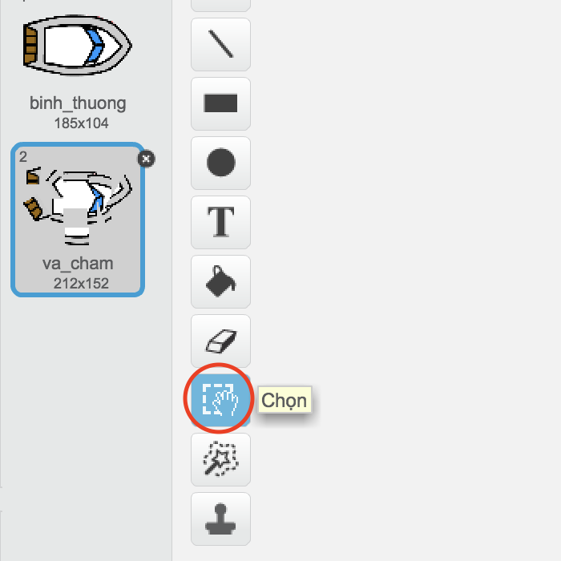
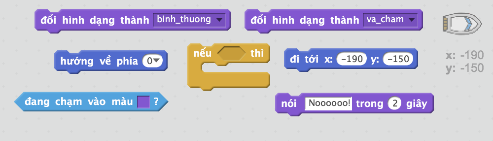
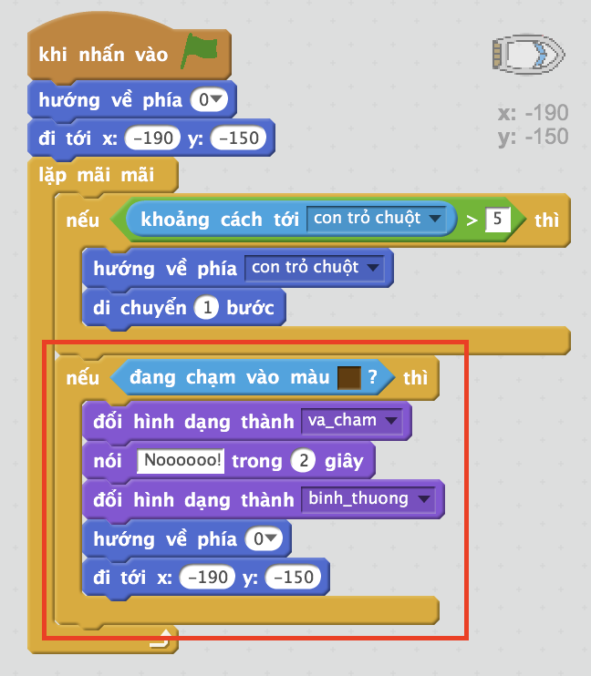

## Crashing!

Tại thời điểm này, thuyền của bạn có thể đi qua hàng rào gỗ! Hãy sửa lỗi đó.

\--- bài tập \---

Bạn sẽ cần hai bộ trang phục cho thuyền của bạn, một bộ trang phục bình thường, và một cho khi chiếc thuyền bị treo. Nhân đôi trang phục thuyền của bạn, và đặt tên cho một bộ trang phục 'bình thường' và 'trang phục' khác.

\--- /bài tập \---

\--- bài tập \---

Nhấp vào trang phục 'hit' của bạn, và chọn công cụ Chọn để lấy bit của thuyền và di chuyển và xoay chúng xung quanh để làm cho nó trông như thể nó bị rơi.

\--- /bài tập \---

\--- bài tập \---

Bây giờ thêm mã vào thuyền của bạn để nó bị treo và vỡ ra khi nó chạm vào bất kỳ bit gỗ nâu nào.

\--- gợi ý \--- \--- gợi ý \--- Bạn cần thêm mã bên trong vòng lặp `mãi mãi` của bạn để mã của bạn tiếp tục kiểm tra xem thuyền có bị hỏng hay không. `Nếu` thuyền được `chạm` màu nâu của gỗ, bạn cần phải `chuyển sang hit trang phục`, `nói noooo! trong 2 giây`, và sau đó `chuyển về trang phục bình thường`. Cuối cùng, bạn sẽ cần phải `điểm lên` và `đi đến vị trí bắt đầu`. \--- / hint \--- \--- hint \--- Dưới đây là các khối mã bạn sẽ cần:  \--- / hint \--- \--- hint \--- Dưới đây là mã của bạn sẽ như thế nào:  \--- / gợi ý \--- \--- / gợi ý \---

\--- /bài tập \---

\--- bài tập \---

Bạn cũng nên đảm bảo rằng thuyền của bạn luôn bắt đầu trông 'bình thường'.

Nếu bạn cố gắng đi qua một hàng rào bằng gỗ ngay bây giờ, bạn sẽ thấy rằng chiếc thuyền của bạn bị treo và di chuyển trở lại đầu.

\--- /bài tập \---