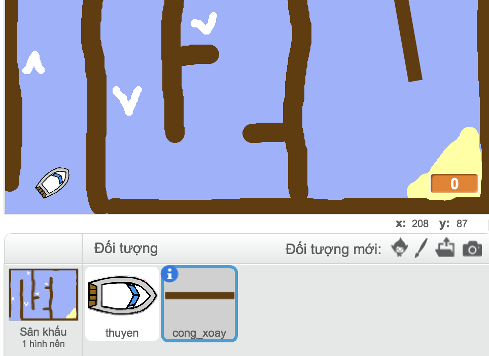
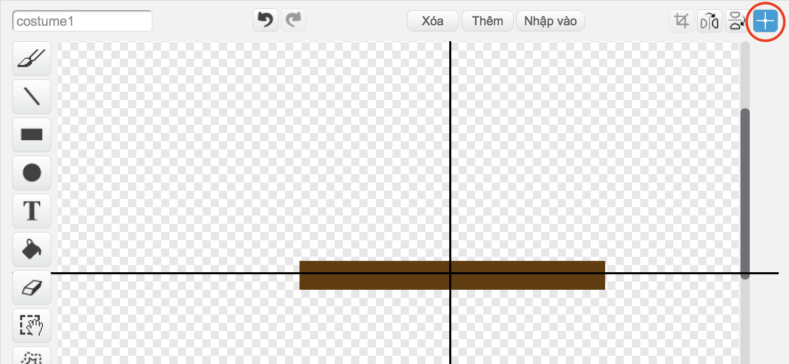

## Chướng ngại vật và tên lửa đẩy

Ngay bây giờ trò chơi là **xa** quá dễ dàng, vì vậy bạn sẽ thêm một số điều để làm cho nó thú vị hơn.

Đầu tiên, bạn sẽ thêm một số tên lửa đẩy để tăng tốc thuyền.

\--- task \---

Chỉnh sửa phông nền sân khấu của bạn bằng cách thêm vào một số mũi tên tăng cường màu trắng.


\--- /task \---

\--- task \---

Bây giờ thêm nhiều khối mã vào vòng lặp `của thuyền của bạn mãi mãi`{: class = "block3control"} để thuyền sprite di chuyển thêm ba bước khi chạm vào mũi tên trắng. 

```blocks3
nếu <touching color [#FFFFFF] ?> thì
di chuyển (3) bước
kết thúc
```

\--- /task \---

\--- task \---

Kiểm tra trò chơi của bạn để xem liệu mũi tên tăng cường mới của bạn tăng tốc thuyền.

\--- /bài tập \---

Tiếp theo bạn sẽ thêm một cổng quay mà thuyền phải tránh.

\--- task \---

Thêm một sprite mới trông như thế này và gọi nó là 'gate':



Hãy chắc chắn rằng màu sắc của sprite cổng giống với màu của hàng rào gỗ.

\--- /task \---

\--- task \---

Hãy chắc chắn rằng tâm của sprite cổng được đặt ở giữa.



\--- /task \---

\--- task \---

Thêm mã vào sprite cổng của bạn để làm cho nó quay chậm mãi mãi.

\--- gợi ý \--- \--- gợi ý \--- Thêm khối mã để sprite cổng để nó `lượt 1 độ`{: class = "block3motion"} `mãi mãi`{: class = "block3control"} . \--- / gợi ý \--- \--- gợi ý \--- Đây là các khối mã bạn cần: 

```blocks3
mãi mãi
kết thúc

lượt cw (1) độ

khi cờ được nhấp
```

\--- / gợi ý \--- \--- gợi ý \--- Đây là mã mới của bạn sẽ như thế nào: 

```blocks3
khi cờ nhấp
mãi mãi
lượt cw (1) độ
kết thúc
```

\--- /hint \--- \--- /hints \---

\--- /bài tập \---

\--- task \---

Kiểm tra lại trò chơi của bạn. Bây giờ bạn nên có một cổng quay mà bạn cần phải khuấy thuyền của bạn xung quanh.


\--- /task \---