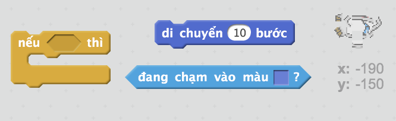
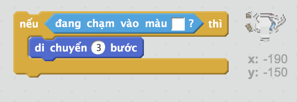
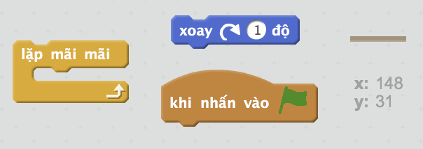
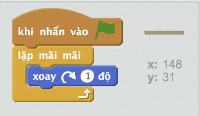

## Chướng ngại vật và tăng tốc

Ngay bây giờ trò chơi này vẫn *quá* dễ dàng - hãy thêm một vài thứ để làm cho nó thú vị hơn.

\--- task \---

Trước tiên, hãy thêm một số 'tăng tốc' vào trò chơi của bạn để tăng tốc độ thuyền. Chỉnh sửa phông nền Sân khấu của bạn và thêm một số mũi tên tăng tốc màu trắng.

\--- /task \---

\--- task \---

Bây giờ thêm code vào vòng lặp mãi mãi của thuyền để nó di chuyển thêm ba bước khi nó chạm vào mũi tên tăng tốc màu trắng.

\--- hints \--- \--- hint \--- `Nếu` thuyền của bạn `đang chạm vào mũi tên trắng`, thì nó sẽ `di chuyển thêm 3 bước`.  
\--- /hint \--- \--- hint \--- Dưới đây là các khối code bạn sẽ cần:  \--- /hint \--- \--- hint \--- Code của bạn sẽ trông giống như thế này:  \--- /hint \--- \--- /hints \---

\--- /task \---

\--- task \---

Bạn cũng có thể thêm một chiếc cổng xoay mà thuyền của bạn sẽ phải tránh. Thêm một Đối tượng mới gọi là 'cong_xoay' trông giống như sau:

Hãy chắc chắn rằng màu sắc của cổng là giống như màu của các rào cản bằng gỗ.

\--- /task \---

\--- task \---

Đặt trung tâm của Đối tượng 'cong_xoay'.

\--- /task \---

\--- task \---

Thêm code vào cổng xoay của bạn để làm cho nó quay chậm mãi mãi.

\--- hints \--- \--- hint \--- Thêm code vào Đối tượng 'cong_xoay' để nó `xoay 1 độ` `mãi mãi`. \--- /hint \--- \--- hint \--- Dưới đây là các khối code bạn sẽ cần:  \--- /hint \--- \--- hint \--- Code của bạn sẽ trông giống như thế này:  \--- /hint \--- \--- /hints \---

\--- /task \---

\--- task \---

Kiểm tra trò chơi của bạn. Bây giờ bạn sẽ có một cánh cổng xoay mà bạn phải tránh.

\--- /task \---