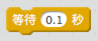
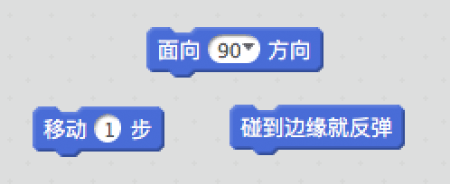
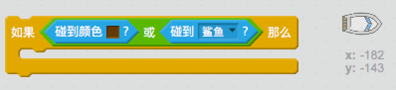

\---challenge \---

## 挑战: 更多障碍！

你能为你的游戏添加更多障碍吗？下面是一些点子：

\--- task \---

你可以在背景中加入绿色泥沼并对游戏进行更改，让玩家碰到这些泥沼时赛艇减速。

\--- hints \--- \--- hint \--- 你可以使用`等待`代码块来实现这个功能：  \--- /hint \--- \--- /hints \---

\--- /task \---

\--- task \---

你可以添加移动障碍物，例如树桩或鲨鱼！

\--- hints \--- \--- hint \--- 这些代码块有助于你移动新的障碍物：

如果你的新障碍物不是棕色的，你需要在你的赛艇代码中加入如下代码：

 \--- /hint \--- \--- /hints \---

\--- /task \---

\--- /challenge \---