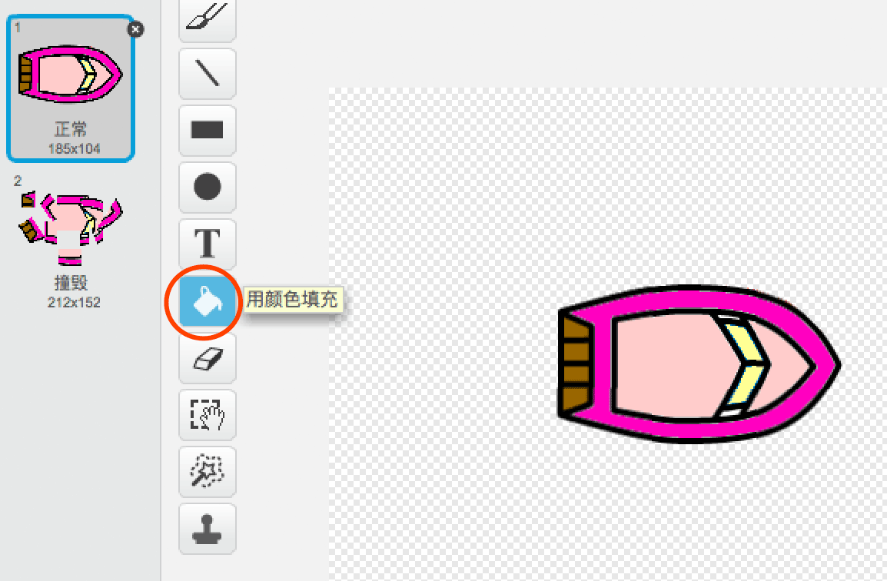
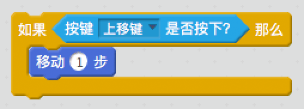

\--- challenge \---

## 挑战: 更多赛艇！

你能将你的游戏变成2人竞赛吗？第2个玩家需要用键盘的上箭头移动赛艇用左右箭头转向。

\--- hints \--- \--- hint \--- 复制赛艇并修改赛艇2的颜色。

 \--- /hint \--- \--- hint \--- 修改代码让2个赛艇的起始位置不同：

 \--- /hint \--- \--- hint \--- 删除赛艇2中用鼠标控制赛艇的代码该用键盘方向键控制。 \--- /hint \--- \--- hint \--- 这是你移动赛艇2需要用到的代码块：

 \--- /hint \--- \--- hint \--- 你还需要编码实现当键盘左右方向键按下时*旋转*赛艇。 \--- /hint \--- \--- /hints \---

\--- /challenge \---