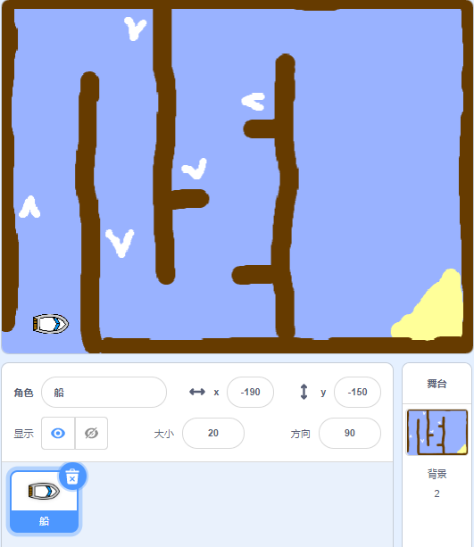

## 开始

\--- task \---

打开初始项目。

## \--- collapse \---

title: 使用在线版Scratch

## image: images/image.png

点击 [jumpto.cc/boat-go](https://scratch.mit.edu/projects/63958014/#editor){:target="_blank"} 打开“赛艇比赛”的Scratch初始项目。 \--- /collapse \---

## \--- collapse \---

title: 使用离线版Scratch

## image: images/image.png

点击 [jumpto.cc/boat-get](http:jumpto.cc/boat-get){:target="_blank"} 下载“赛艇比赛”的Scratch初始项目，然后在Scratch离线编辑器中打开。 \--- /collapse \---

\--- /task \---

\--- task \---

项目中包含赛艇角色和赛道背景：

- 树木是赛艇必须要避开的
- 荒岛是赛艇的目的地
    
    

\--- /task \---