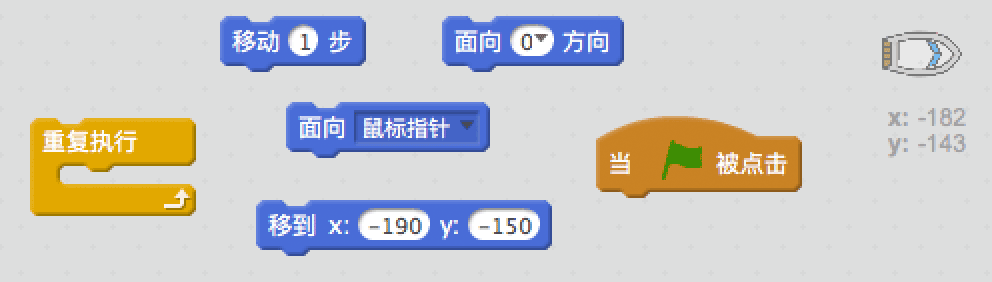
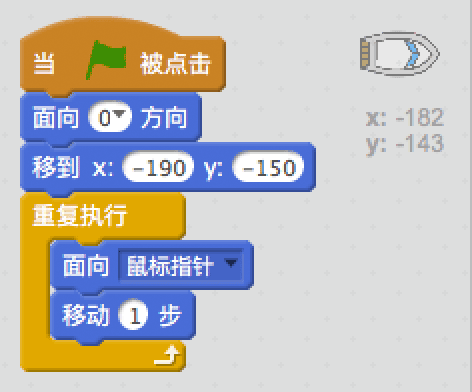
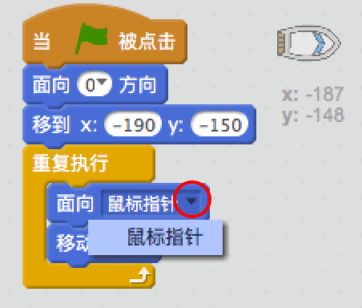
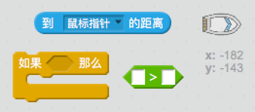

## 控制赛艇

\--- task \---

你需要用鼠标控制赛艇。 为赛艇添加代码让它从舞台左下角向上出发然后跟随鼠标指针移动。 **测试你的代码**以确保它按照预期正常工作。

\--- hints \--- \--- hint \--- 一旦`绿旗被点击`，你需要将赛艇`移到出发位置`并`面向上`。 然后赛艇需要`面向鼠标指针`并`移动1步`。 `重复执行`上面的过程。

\--- /hint \--- \--- hint \--- 这是你需要用到的代码块：  \--- /hint \--- \--- hint \--- 你的代码应该如下图这样：  \--- /hint \--- \--- /hints \---

\--- /task \---

\--- task \---

点击绿旗并移动鼠标来测试你的赛艇。赛艇会向着鼠标航行吗？

## \--- collapse \---

title: 如果你遇到了困难...

## image: images/image.png

**注意：**目前Scratch有bug，可能会导致你的赛艇不会向着鼠标指针移动。 如果发生这种情况，点击`面向`代码块上的箭头并重新选择`鼠标指针`。

 \--- /collapse \---

\--- /task \---

\--- task \---

如果赛艇到达了鼠标指针所在的位置会出现什么情况？试一下。

\--- /task \---

\--- task \---

要阻止这种情况发生，需要在代码中添加一个`如果`代码块，让赛艇只有距离鼠标指针大于5个像素时才移动。

\--- hints \--- \--- hint \--- 赛艇应该面向鼠标指针并且`如果``距离鼠标指针`的距离`大于5个像素`时才移动。 \--- /hint \--- \--- hint \--- 下面是你需要添加到赛艇角色上的代码块：  \--- /hint \--- \--- hint \--- 你的代码应该如下图这样：  \--- /hint \--- \--- /hints \---

\--- /task \---

\--- task \---

再次测试你的赛艇看问题是否解决。

\--- /task \---