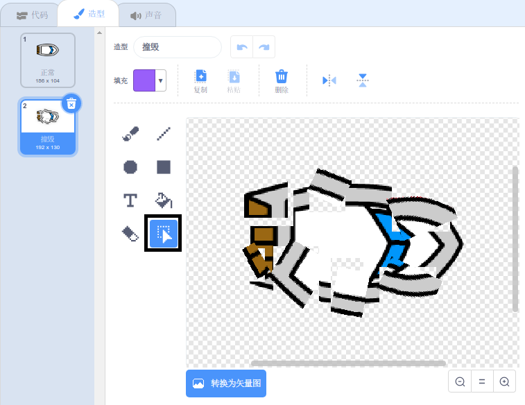

## 撞击!

现在船可以简单地穿过木栅栏！你现在要解决这个问题。

--- task ---

你的艇角色需要两种造型：一种是普通的造型，一种是艇撞毁的时候。复制你的船角色的造型，并命名一个造型'正常'和另一个'撞毁'。

--- /task ---

--- task ---

点击你的“撞毁”造型，然后使用 **选择** 工具来选择造型的碎片，然后移动并旋转它们，使艇看起来像是撞成碎片



--- /task ---

--- task ---

现在将代码添加到您的艇上，以便在碰到任何棕色木质障碍物时撞毁并破碎。

--- hints ---
 --- hint ---

您需要在 `重复执行`{:class="block3control"}循环中添加代码块，以便你的代码继续检查艇角色是否已撞毁，并且如果它已经撞毁，代码需要重置艇角色的位置。

`如果`{:class="block3control"}艇 `接触到`{:class="block3sensing"}木头的棕色，你需要 `切换到撞毁造型`{:class="block3looks"}，`说不～～！ 持续2秒`{:class="block3looks"}，然后 `切换回普通造型`{:class="block3looks"}。 最后，你需要 `指向上`{:class="block3motion"}， 并`走到开始位置`{:class="block3motion"}。

--- /hint --- --- hint ---

以下是你需要的代码块：


```blocks3
go to x: (-190) y: (-150)

switch costume to (击中 v)

point in direction (0)

switch costume to (正常 v)

say [不～～!] for (2) seconds
```

--- /hint --- --- hint ---

您的代码看起来应该是这样的：


```blocks3
when flag clicked
point in direction (0)
go to x: (-190) y: (-150)
forever
if <(distance to (mouse-pointer v)) > [5]> then
point towards (mouse-pointer v)
move (1) steps
end
if <touching color [#663b00] ?> then
switch costume to (击中 v)
say [不～～!] for (2) seconds
switch costume to (正常 v)
point in direction (0)
go to x: (-190) y: (-150)
end
```

--- /hint ------ /hints ---

--- /task ---

--- task ---

您还应该添加代码以确保您的艇角色始终开始看起来“正常”。

再次测试您的代码。如果你现在尝试通过一个木制障碍，船应该撞毁，然后回到它的起始位置。


--- /task ---