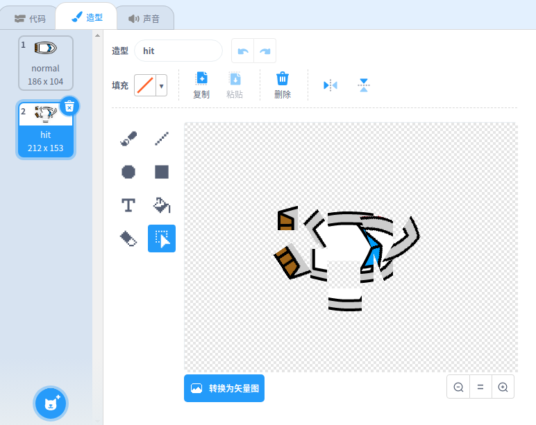
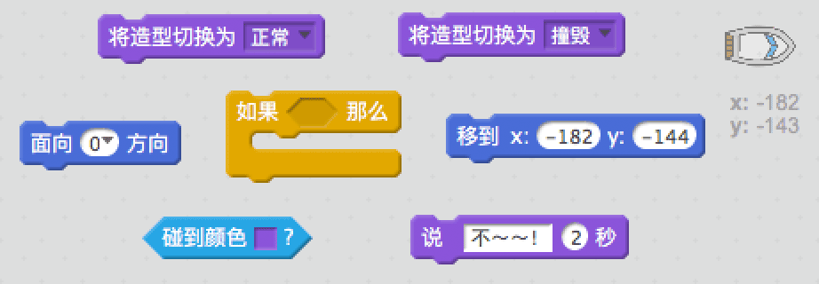
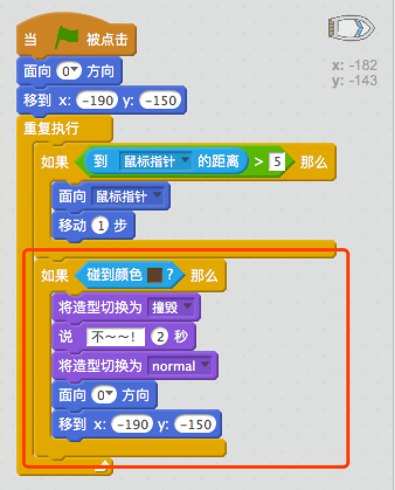

## 撞击!

目前，你的赛艇还可以穿过木栅栏！我们来修复这个问题。

\--- task \---

你的赛艇需要2个造型，一个正常造型，一个撞击造型。复制赛艇造型，将一个命名为“正常”另一个命名为“撞击”。

\--- /task \---

\--- task \---

点击“撞击”造型，选中选择工具，框住赛艇的一部分然后移动旋转框住的部分，让船看上去像被撞碎了一样。

\--- /task \---

\--- task \---

现在为赛艇加入代码让它碰到棕色像素时分崩离析。

\--- hints \--- \--- hint \--- 你的代码需要添加到`重复执行`循转中，以确保代码不断检测赛艇是否撞毁。 `如果`赛艇`碰到`木头的棕色，你需要`切换到撞毁造型`并`说不！ 2秒钟`，然后`切换回正常造型`。 最后，你需要`让赛艇朝上`并`回到起点`。 \--- /hint \--- \--- hint \--- 这是你需要用到的代码块：  \--- /hint \--- \--- hint \--- 你的代码应该如下图这样：  \--- /hint \--- \--- /hints \---

\--- /task \---

\--- task \---

你同时需要确保赛艇起始时永远都是“正常”造型。

现在如果你尝试穿过木栅栏，你应该看到你的赛艇被撞毁并重返起点。

\--- /task \---