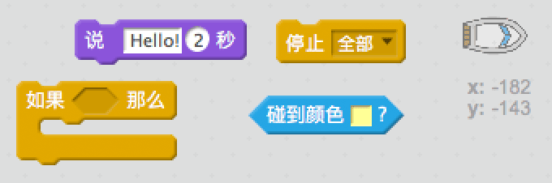
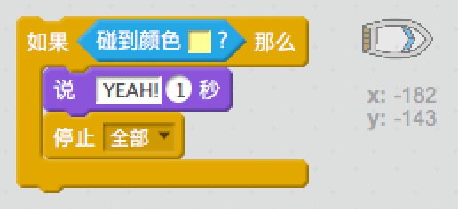

## 挑战: 获胜！

你能为赛艇代码加入另一个`如果`语句，让玩家在赛艇到达荒岛时获胜吗？

当赛艇抵达黄色荒岛时，游戏应该显示“YEAH！”并停止。

\--- hints \--- \--- hint \--- 你需要在`重复执行`循环中加入更多的代码，让代码不断检测玩家是否获胜。 `如果`赛艇`碰到`珍宝岛的颜色，游戏应该`说“YEAH！”2秒钟`然后`停止所有`代码，游戏结束。 \--- /hint \--- \--- hint \--- 这是你需要用到的代码块：  \--- /hint \--- \--- hint \--- 你的代码应该如下图这样： 

别忘了新代码需要添加到`重复执行`训话内部。 \--- /hint \--- \--- /hints \---