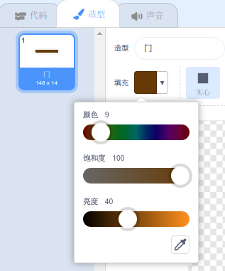

## 计时赛

现在游戏是 **远** 太容易了，所以你会添加一些东西，使它更有趣。

首先，你将添加一些助推器来加速船。

\--- task \---

通过添加一些白色助推器箭头来编辑您的舞台背景。


\--- /task \---

\--- task \---

现在添加更多的代码块，你的船的 `永远`{：类=“block3control”}循环，使艇精灵移动三个额外的步骤时，倒是一个白色箭头。 

```blocks3
如果 <touching color [#FFFFFF] ?> 然后
移动（3）步骤
结束
```

\--- /task \---

\--- task \---

测试你的游戏，看看你的新助推器箭是否加速了船。

\--- /task \---

接下来，您将添加船只必须避免的旋转门。

\--- task \---

添加一个看起来像这样的新精灵，并将其命名为'gate'：


确保门精灵的颜色与木质障碍物的颜色相同。



\--- /task \---

\--- task \---

Make sure that the centre of the gate sprite is positioned in the middle.


\--- /task \---

\--- task \---

Add code to your gate sprite to make it spin slowly forever.

\--- hints \--- \--- hint \--- Add code blocks to the gate sprite so that it `turns 1 degree`{:class="block3motion"} `forever`{:class="block3control"}. \--- /hint \--- \--- hint \--- Here are the code blocks you need: 

```blocks3
永远
结束

点击标志时转cw（1）度


```

\--- /hint \--- \--- hint \--- Here's what your new code should look like: 

```blocks3
当标志点击
永远
转cw（1）度
结束
```

\--- /hint \--- \--- /hints \---

\--- /task \---

\--- task \---

Test your game again. You should now have a spinning gate that you need to stir your boat around.


\--- /task \---