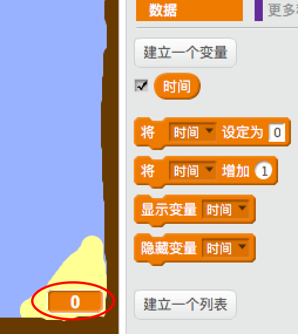
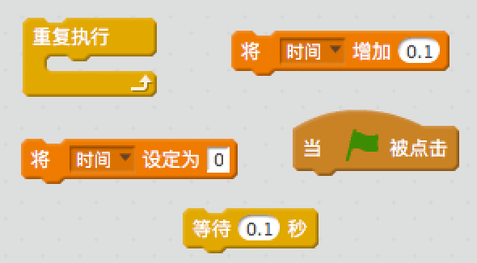
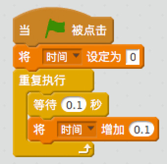
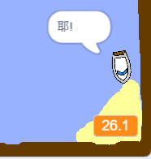

## 计时赛

让我们为游戏加入计时器，让玩家尽可能快地到达荒岛。

\--- task \---

在舞台上新建一个叫`时间`的变量。你可以修改新变量的显示方式。

[[[generic-scratch-add-variable]]]

\--- /task \---

\--- task \---

为舞台加入代码让计时器在赛艇到达荒岛之前一直计时。

\--- hints \--- \--- hint \--- 在舞台上，`当绿旗被点击时`，`将时间设置为0`。 在`重复执行`代码块中，你需要先`等待0.1秒`，然后`将时间增加0.1`。 \--- /hint \--- \--- hint \--- 这是你需要用到的代码块：  \--- /hint \--- \--- hint \--- 你的代码应该如下图这样：  \--- /hint \--- \--- /hints \---

\--- /task \---

\--- task \---

就是这样！测试你的游戏，看看你能多快到达荒岛！

\--- /task \---