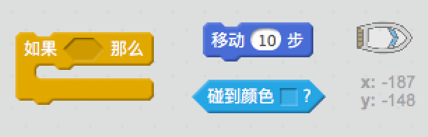
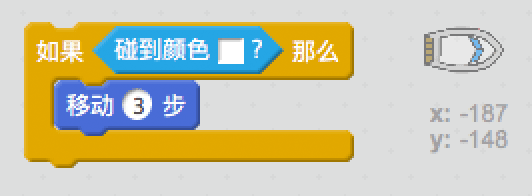
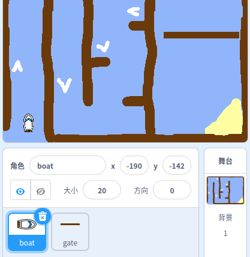
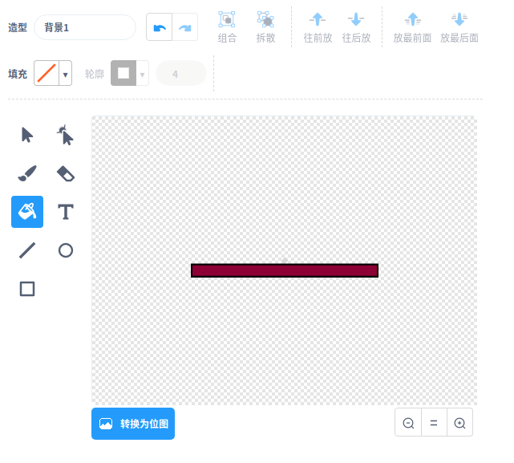
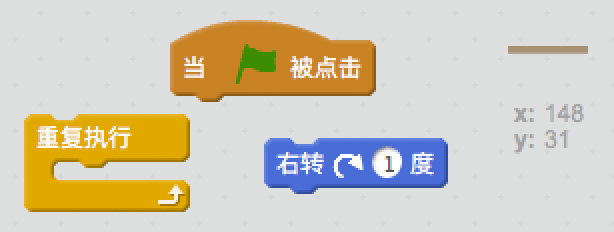
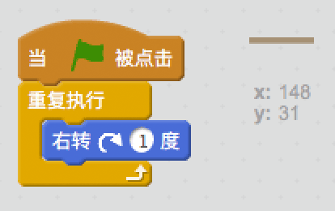
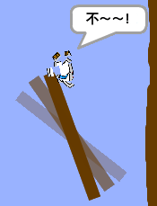

## 障碍与助力

目前游戏*太过*简单--让我们增加些难度提高一下游戏的乐趣。

\--- task \---

首先我们为游戏加入一些“加速点”来提升赛艇的速度。比编辑舞台背景加入一些白色的加速箭头。

\--- /task \---

\--- task \---

在赛艇的重复执行循环中加入一些代码让赛艇触碰到白色加速标志时速度提升3倍。

\--- hints \--- \--- hint \--- `如果`赛艇`碰到白色加速标志`，那么它应该`额外移动3步`。  
\--- /hint \--- \--- hint \--- 下面是你需要用到的代码块：  \--- /hint \--- \--- hint \--- 你的代码应该如下图这样：  \--- /hint \--- \--- /hints \---

\--- /task \---

\--- task \---

你还可以添加一个旋转门来让赛艇必须躲避。添加一个名叫“旋转门”的角色，如下图：

确保旋转门的颜色与木栅栏的颜色一致。

\--- /task \---

\--- task \---

设置旋转门角色的中心。

\--- /task \---

\--- task \---

添加代码让旋转门不停地缓慢旋转。

\--- hints \--- \--- hint \--- 为旋转门角色添加代码让它`不停地``旋转1度`。 \--- /hint \--- \--- hint \--- 这是你需要用到的代码块：  \--- /hint \--- \--- hint \--- 你的代码应该如下图这样：  \--- /hint \--- \--- /hints \---

\--- /task \---

\--- task \---

测试你的游戏。现在你应该能看到一个必须避开的旋转门。

\--- /task \---