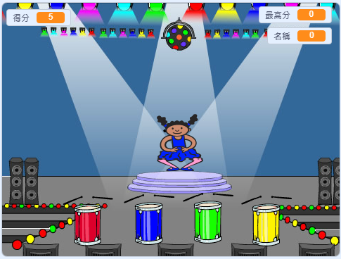

## 然後呢？

恭喜你完成了「划船比賽」專案！ 你想要做些更有挑戰性的玩意兒嗎？

試試[記憶力大考驗](https://projects.raspberrypi.org/en/projects/memory?utm_source=pathway&utm_medium=whatnext&utm_campaign=projects)專案。

--- no-print ---

點擊綠旗開始， 舞者在舞台上會更換不同的服裝，請在觀看後依序點擊顏色。 如果你搞錯顏色順序，就代表你的記憶力…不太行！

  <iframe allowtransparency="true" width="485" height="402" src="//scratch.mit.edu/projects/embed/284452634/?autostart=false" frameborder="0" allowfullscreen scrolling="no" mark="crwd-mark"></iframe> 

--- /no-print ---

--- print-only ---

--- /print-only ---

***

這個專案由以下志工翻譯：

Dnow Ba
余澄祐

感謝志工們，我們才能為來自世界各地的人們提供學習機會。你也可以擔任翻譯志工，幫我們創造更多機會，若要進一步瞭解，請造訪 [rpf.io/translate](https://rpf.io/translate)。