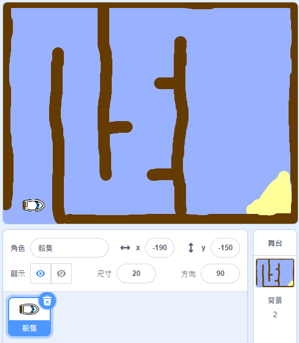

## 開始

\--- task \---

打開開始項目。

## \--- collapse \---

標題：我在線上使用Scratch

## image: images/image.png

Open the 'Boat Race' Scratch starter project at [jumpto.cc/boat-go](https://scratch.mit.edu/projects/63958014/#editor){:target="_blank"}. \--- /collapse \---

## \--- collapse \---

標題：我正在使用Scratch離線版本

## image: images/image.png

Download the 'Boat Race' Scratch starter project from [jumpto.cc/boat-get](http:jumpto.cc/boat-get){:target="_blank"} and then open it using the offline editor. \--- /collapse \---

\--- /task \---

\--- task \---

該項目包括一個船精靈和一個課程背景：

- 你的船必須避免的木頭
- 你的船必須去的一個荒島
    
    

\--- /task \---