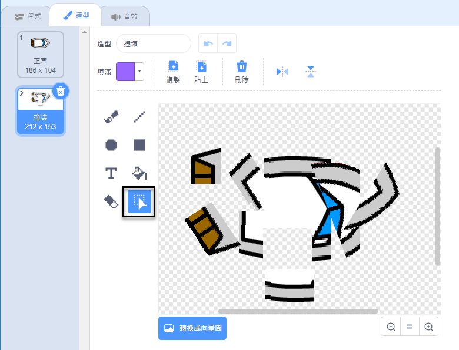
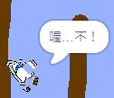

## 崩潰！

此刻，船精靈可以簡單地穿過木柵欄！你現在要解決這個問題。

\---任務\---

你的船精靈需要兩件服裝：一件普通的服裝，一件用於船撞的時候。複製你的船精靈的服裝，並命名一個服裝'正常'和另一個'打'。

\--- /任務\---

\---任務\---

點擊你的“點擊”服裝，然後使用 **選擇** 工具抓住服裝的部分並移動和旋轉它們，使船看起來像是碎成碎片。



\--- /任務\---

\---任務\---

現在將代碼添加到您的船上，以便在碰到任何棕色木質障礙物時崩潰並破碎。

\---提示\--- \---提示\--- 您需要在 `永久`{：class =“block3control”}循環中添加代碼塊，以便您的代碼繼續檢查船精靈是否已經崩潰，並且如果它已經崩潰，代碼需要重置船精靈的位置。

`如果`{：class =“block3control”}船是 `接觸`{：class =“block3sensing”}木材的棕色，你需要 `切換到命中服裝`{：class =“block3looks”} ， `說Noooo！ 持續2秒`{：class =“block3looks”}，然後 `切換回普通服裝`{：class =“block3looks”}。 最後，你需要 `指向`{：class =“block3motion”}， `指向開始位置`{：class =“block3motion”}。

\--- /提示\--- \---提示\--- 以下是您需要的代碼塊： 

```blocks3
如果 <touching color [ ] ?> 然後
結束

轉到x：（-190）y：（ -  150）

切換服裝到（點擊v）

點方向（0）

切換服裝到（正常v）

說[Noooooo！] for （2）秒
```

\--- /提示\--- \---提示\--- 這是你的代碼應該是什麼樣子： 

```blocks3
當標誌點擊
點方向（0）
轉到x：（-190）y：（ -  150）
永遠
如果 <（距離（鼠標指針v）） > [5]> 然後
點朝（鼠標 -指針v）
移動（1）步驟
結束
如果 <touching color [#663b00] ?> 然後
切換服裝到（擊中v）
說[Noooooo！]為（2）秒
開關服裝到（正常v）
點方向（0）
轉到x：（-190）y：（ -  150）
結束
```

\--- /提示\--- \--- /提示\---

\--- /任務\---

\---任務\---

您還應該添加代碼以確保您的船精靈始終開始看起來“正常”。

再次測試您的代碼。如果你現在嘗試通過一個木製障礙船，船應該崩潰，然後回到它的起始位置。



\--- /任務\---