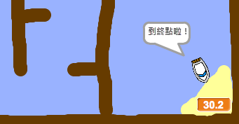

## 添加計時器

現在，您將為遊戲添加計時器，以便玩家必須盡快到達島嶼。

\---任務\---

在舞台上添加一個名為 `time`{：class =“block3variables”}的新變量。


[[[generic-scratch3-add-variable]]]

您還可以通過更改新變量的顯示方式來選擇查找計時器。

\--- /任務\---

\---任務\---

現在將代碼塊添加到舞台上，以便計時器計時，直到船到達島嶼。

\---提示\--- \---提示\--- 在舞台上， `點擊綠色標誌時`{：class =“block3control”}， `將時間設置為0`{：class =“block3variables “}。 裡面的 `永遠`{：類=“block3control”}循環，你需要先 `等待0.1秒`{：類=“block3control”}，然後 `改變的時間由0.1`{：類=“block3variables” }。 \--- /提示\--- \---提示\--- 以下是您需要的代碼塊： 

```blocks3
當標誌點擊

永久
結束

等待（0.1）秒

設置[時間v]到 [0]時，將[時間v]改變為（0.1）


```

\--- /提示\--- \---提示\--- 這是你的新代碼應該是什麼樣子： 

```blocks3
當標記點擊時
設置[時間v]到 [0]
永遠
等待（0.1）秒
改變[時間v]乘以（0.1）
結束
```

\--- /提示\--- \--- /提示\---

\--- /任務\---

\---任務\---

測試你的遊戲，看看你有多快把船送到島上！



\--- /任務\---