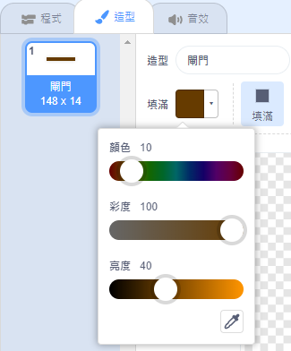
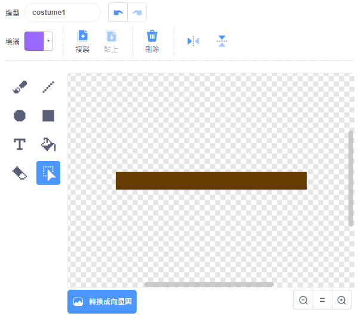
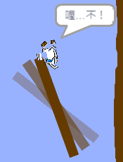

## 障礙與加速

遊戲目前**太**容易了，我們來加些東西，讓它更有趣。

首先，添加一些助推器來幫船隻加速。

\--- task \---

編輯舞台背景，添加一些白色的箭頭當作助推器（好像大海浪那樣）。


\--- /task \---

\--- task \---

在船隻的`重複無限次`{:class="block3control"}迴圈裡頭添加更多程式，讓角色碰到白色箭頭時移動 3 點。


```blocks3
如果 <碰到顏色 (#ffffff)？> 那麼
移動 (3) 點
end
```

\--- /task \---

\--- task \---

測試遊戲，看看你的新助推器是否能幫船隻加速。

\--- /task \---

接著，再多個障礙，這次來個會旋轉的閘門。

\--- task \---

添加一個像這樣的角色，並將它命名為「閘門」：


務必確認閘門的顏色和木柵欄的顏色一致。



\--- /task \---

\--- task \---

務必確認角色的中心點在閘門圖像的中間。



\--- /task \---

\--- task \---

加入程式，讓閘門在遊戲裡一直緩慢的旋轉。

\--- hints \--- \--- hint \---

為閘門角色編寫程式，讓這個障礙物 `不停的`{:class="block3control"}的`旋轉 1 度`{:class="block3motion"}。

\--- /hint \--- \--- hint \---

這裡是你需要的程式積木：


```blocks3
重複無限次
end

右轉 @turnright (1) 度

當 @greenflag 被點擊
```

\--- /hint \--- \--- hint \---

你的程式看起來應該像這樣：


```blocks3
當 @greenflag 被點擊
重複無限次
右轉 @turnright (1) 度
end
```

\--- /hint \--- \--- /hints \---

\--- /task \---

\--- task \---

再測試遊戲，現在你應該有個旋轉的閘門，船隻要繞著這個障礙物，避免被它撞壞，才能通過閘道。



\--- /task \---